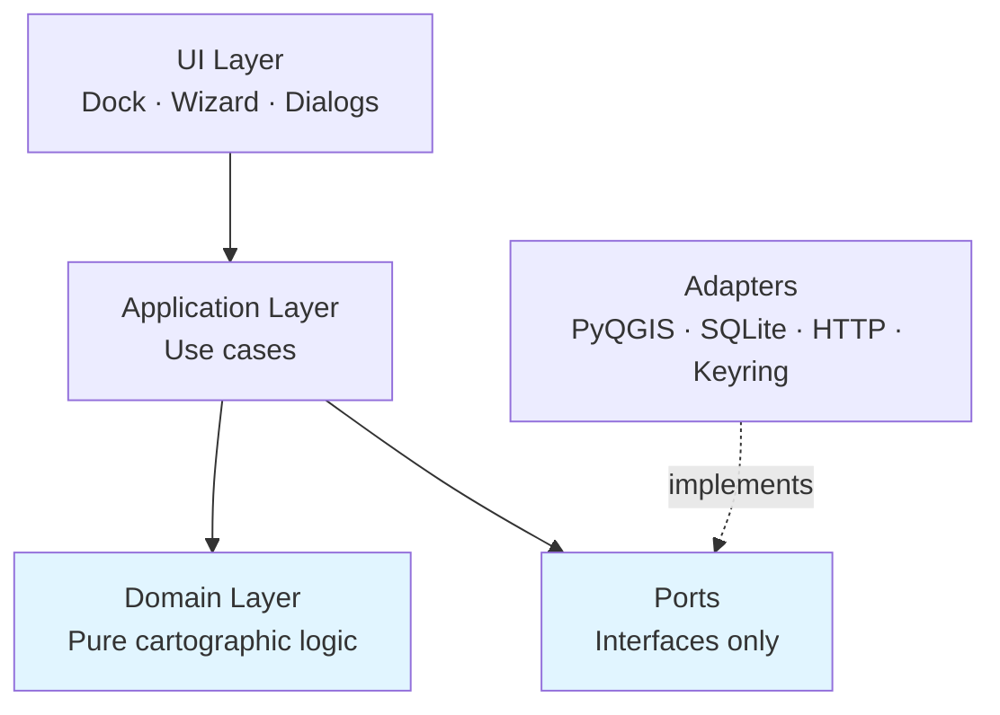

# Smart Layout Builder

> Production-grade automatic map layout, smart legends, batch atlas export, and AI-assisted cartography for QGIS.

[](https://www.gnu.org/licenses/gpl-3.0)
[](https://qgis.org)
[](https://www.python.org)
[](docs/development-roadmap.md)

---

## Overview

**Smart Layout Builder** (SLB) turns QGIS's print-layout workflow into a fast, template-driven, AI-assisted production system. Where the native Layout Designer is a *canvas*, SLB is a *factory*:

- 🪄 **One-click layout generation** — balanced layouts from project state.
- 🧹 **Smart Legend Cleaner** — drops hidden / out-of-extent / redundant layers automatically.
- 📚 **Batch Atlas Export** — parallel rendering of hundreds of pages, cancellable, resumable.
- 🧩 **Reusable Templates** — package layouts as `.slbtmpl` archives; lock for orgs.
- ✨ **Dynamic Text Engine** — token system layered on top of QGIS expressions.
- 🧠 **AI Assistant** — pluggable providers (OpenAI / Anthropic / Azure / local Ollama).
- 📐 **Adaptive Layouts** — recompose on paper resize, orientation flip, content change.
- 📦 **Marketplace + Cloud Sync** (future) — share templates publicly or within your org.

> *"A GIS analyst should be able to go from `.qgz` → publication-ready PDF series for 200 administrative units in under 5 minutes, without opening the Layout Designer once."*

---

## Screenshots

<p align="center">
  <em>Coming with the 1.0.0 MVP. Placeholders below.</em>
</p>

| Compose Tab | Atlas Tab | AI Assistant |
|:-----------:|:---------:|:------------:|
| `docs/images/compose.png` | `docs/images/atlas.png` | `docs/images/ai.png` |

| Live Preview | Template Library | Wizard |
|:------------:|:----------------:|:------:|
| `docs/images/preview.png` | `docs/images/templates.png` | `docs/images/wizard.png` |

---

## Status

> **Pre-alpha — planning phase.** No code yet; the project is currently producing the architecture and feature specs. See [`docs/`](docs/) for the planning artifacts.

- ✅ Plan ([`docs/plan.md`](docs/plan.md))
- ✅ Architecture ([`docs/architecture.md`](docs/architecture.md))
- ✅ Folder structure ([`docs/folder-structure.md`](docs/folder-structure.md))
- ✅ Features ([`docs/features.md`](docs/features.md))
- ✅ UI / UX ([`docs/ui-ux.md`](docs/ui-ux.md))
- ✅ API design ([`docs/api-design.md`](docs/api-design.md))
- ✅ Database schema ([`docs/database-schema.md`](docs/database-schema.md))
- ✅ Roadmap ([`docs/development-roadmap.md`](docs/development-roadmap.md))
- ✅ Testing strategy ([`docs/testing-strategy.md`](docs/testing-strategy.md))
- ✅ Plugin spec ([`docs/plugin-specification.md`](docs/plugin-specification.md))
- ✅ Coding standards ([`docs/coding-standards.md`](docs/coding-standards.md))
- ✅ AI prompt library ([`docs/prompts/`](docs/prompts/))
- 🟡 1.0.0 MVP — *in planning*, target 10 weeks after kickoff.

---

## Installation

> *Not yet installable. Once 1.0.0 ships:*

### From the QGIS Plugin Repository (recommended)

1. Open QGIS → `Plugins` → `Manage and Install Plugins…`
2. Search for **Smart Layout Builder**.
3. Click `Install`.
4. Enable from the toolbar (🪄 icon) or `Plugins → Smart Layout Builder`.

### From a ZIP

1. Download the latest signed ZIP from [Releases](https://github.com/<org>/smart-layout-builder/releases).
2. `Plugins → Manage and Install Plugins… → Install from ZIP`.
3. Pick the downloaded file.

### Compatibility

| SLB | QGIS LTR | Python | PyQt |
|-----|----------|--------|------|
| 1.0 – 1.2 | 3.28 / 3.34 | 3.9+ | PyQt5 |
| 1.3 – 1.4 | 3.34 / 3.40 | 3.10+ | PyQt5 / PyQt6 |
| 2.0+ | 3.40+ | 3.11+ | PyQt6 |

See [`docs/plugin-specification.md`](docs/plugin-specification.md#4-compatibility-matrix) for the full matrix.

---

## Quick Start

> *Once the MVP ships.* These steps describe the intended UX.

1. Open a project with at least one layer.
2. Click the 🪄 SLB toolbar icon.
3. The Compose tab opens — pick a preset, paper, orientation.
4. Click **Generate Layout** → a new `QgsPrintLayout` is created.
5. Click **Open in Designer** to fine-tune, or **Export** straight from SLB.

For batch atlas:

1. Switch to the **Atlas** tab.
2. Pick the coverage layer + filter.
3. Set the output folder and filename template (`peta_[%kelurahan%].pdf`).
4. Click **Start Export**. Progress and ETA appear; cancel any time.

---

## Development Setup

### Prerequisites

- QGIS LTR installed (3.28 / 3.34 / 3.40).
- Python 3.9+ (matching the QGIS Python).
- `make` (or use the `scripts/` Python equivalents on Windows).
- An OS keyring backend (`gnome-keyring`, macOS Keychain, Windows Credential Manager) for secret tests.

### Clone & bootstrap

```bash
git clone https://github.com/<org>/smart-layout-builder.git
cd smart-layout-builder
python -m venv .venv
source .venv/bin/activate     # Windows: .venv\Scripts\activate
pip install -r requirements-dev.txt
pre-commit install
```

### Run the test suite

```bash
make test            # unit + integration + arch
make test-fast       # unit only
make qgis-test       # integration tests inside QGIS
make benchmark       # performance tests
```

### Live-develop in QGIS

```bash
make link            # symlink slb/ into ~/.qgis/<profile>/python/plugins/
make watch           # watch + recompile resources + i18n on change
qgis --profile-folder /tmp/slb_dev
```

### Build a release ZIP

```bash
make package         # → dist/smart_layout_builder-<version>.zip
make package-signed  # also writes .sig
```

See [`docs/coding-standards.md`](docs/coding-standards.md) for style, typing, and review rules.

---

## Architecture Summary



- **Hexagonal architecture** — the domain knows nothing of QGIS, Qt, or the filesystem.
- **Use-case orchestration** — every user action is a single `UseCase.execute(cmd)`.
- **Pluggable strategies** — composition, AI providers, exporters, template loaders, tokens.
- **Event bus** — decouples UI updates from service work.
- **Schema-versioned persistence** — SQLite + JSON, forward-migrated on launch.

Read more: [`docs/architecture.md`](docs/architecture.md).

---

## Roadmap

| Phase | Theme | Releases | Target |
|-------|-------|----------|--------|
| 0 | Bootstrap | — | Week 2 |
| 1 | MVP — Core Layout & Atlas | **1.0.0** | Week 13 |
| 2 | Advanced Layout & Templates | 1.1, 1.2 | Week 21 |
| 3 | AI Assistant | 1.3, 1.4 | Week 29 |
| 4 | Marketplace, Cloud, Reports | **2.0.0** | Week 42 |

Full plan: [`docs/development-roadmap.md`](docs/development-roadmap.md).

---

## Features at a Glance

| # | Feature | Phase | Status |
|---|---------|-------|--------|
| F01 | [Auto Layout Generator](docs/features.md#f01--auto-layout-generator) | MVP | Planned |
| F02 | [Smart Legend Cleaner](docs/features.md#f02--smart-legend-cleaner) | MVP | Planned |
| F04 | [Batch Atlas Export](docs/features.md#f04--batch-atlas-export) | MVP | Planned |
| F06 | [Layout Presets](docs/features.md#f06--layout-presets) | MVP | Planned |
| F09 | [Preview System](docs/features.md#f09--preview-system) | MVP | Planned |
| F12 | [Template Manager](docs/features.md#f12--template-manager) | MVP | Planned |
| F03 | [Adaptive Layout](docs/features.md#f03--adaptive-layout-system) | Phase 2 | Planned |
| F05 | [Dynamic Text Engine](docs/features.md#f05--dynamic-text-engine) | Phase 2 | Planned |
| F07 | [AI Layout Assistant](docs/features.md#f07--ai-layout-assistant) | Phase 3 | Planned |
| F08 | [Report Export](docs/features.md#f08--report-export) | Phase 4 | Planned |
| F10 | [Template Marketplace](docs/features.md#f10--template-marketplace-future) | Phase 4 | Planned |
| F11 | [Cloud Sync](docs/features.md#f11--cloud-sync-future) | Phase 4 | Planned |

Full breakdown: [`docs/features.md`](docs/features.md).

---

## Contributing

We welcome contributions from the QGIS community. Before opening a PR:

1. Read [`CONTRIBUTING.md`](CONTRIBUTING.md) (coming with bootstrap).
2. Read the relevant docs:
   - [`docs/coding-standards.md`](docs/coding-standards.md)
   - [`docs/architecture.md`](docs/architecture.md)
   - [`docs/testing-strategy.md`](docs/testing-strategy.md)
3. Look for issues labeled `good first issue`.
4. Open a draft PR early; we'd rather give feedback sooner than later.

We follow:

- [Contributor Covenant 2.1](CODE_OF_CONDUCT.md) for community conduct.
- [Conventional Commits](https://www.conventionalcommits.org/) for commit messages.
- SemVer for releases.
- Hexagonal architecture for code organization.

**Bugs without a regression test do not merge.**

---

## AI & Privacy

The AI Assistant (Phase 3) is:

- ✅ **Opt-in** — disabled by default.
- ✅ **Provider-pluggable** — bring your own key, including local Ollama for offline use.
- ✅ **Sanitized** — file paths, hostnames, and PII patterns are stripped before any data leaves your machine.
- ✅ **Schema-validated** — model output is parsed against JSON Schema; bad output is rejected.
- ✅ **Budgeted** — monthly token / cost ceilings configurable.
- ✅ **Auditable** — every AI request and response is logged locally, viewable in Settings → AI → History.

Prompt library: [`docs/prompts/`](docs/prompts/).

---

## License

This project is licensed under **GPL-3.0-or-later** — see [`LICENSE`](LICENSE).

This license is intentional: it matches QGIS itself, ensures derived works stay open, and is compatible with the QGIS Plugin Repository.

---

## Acknowledgements

- The **QGIS** community — for the tool we all build on.
- The **PyQGIS** documentation and the maintainers who keep it current.
- The **Cassowary** constraint-solving algorithm — inspiration for our adaptive engine.
- Icon set: [Tabler Icons](https://tabler.io/icons) (MIT).
- Default bundled fonts: [Inter](https://rsms.me/inter/) (OFL).
- Inspiration from prior art: [`qgis2web`](https://plugins.qgis.org/plugins/qgis2web/), [`MapSwipe`](https://github.com/mapswipe/python-mapswipe-workers), [`Layout Manager`](https://github.com/akbargumbira/qgis_layout_manager) and many others.

---

## Links

- 🌐 Website: <https://smart-layout-builder.org> *(planned)*
- 📖 Docs: <https://docs.smart-layout-builder.org> *(planned)*
- 🐛 Issues: <https://github.com/<org>/smart-layout-builder/issues>
- 💬 Discussions: <https://github.com/<org>/smart-layout-builder/discussions>
- 📦 QGIS Plugin: <https://plugins.qgis.org/plugins/smart_layout_builder/> *(planned)*

---

<p align="center">
  <em>Built with discipline, cartographic taste, and respect for the open-source ecosystem that makes it possible.</em>
</p>
