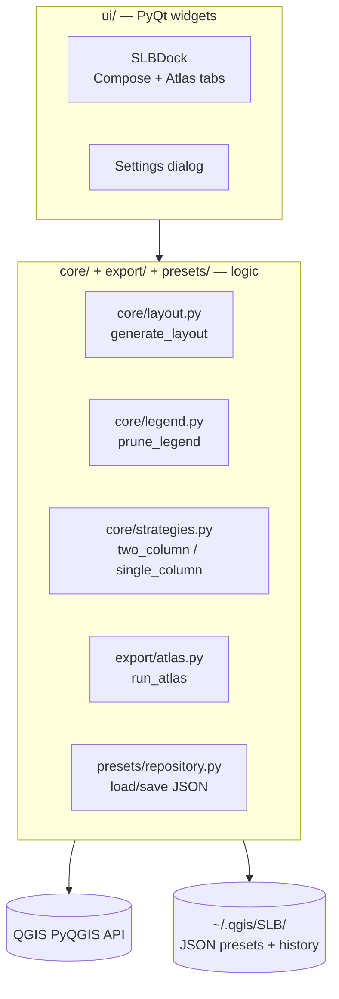
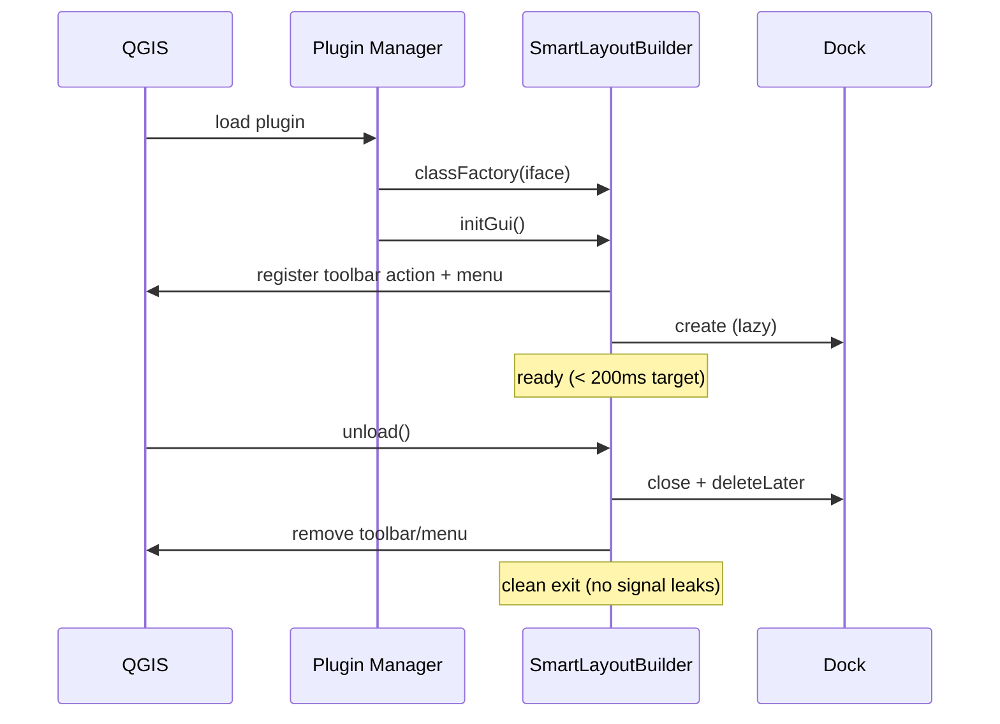
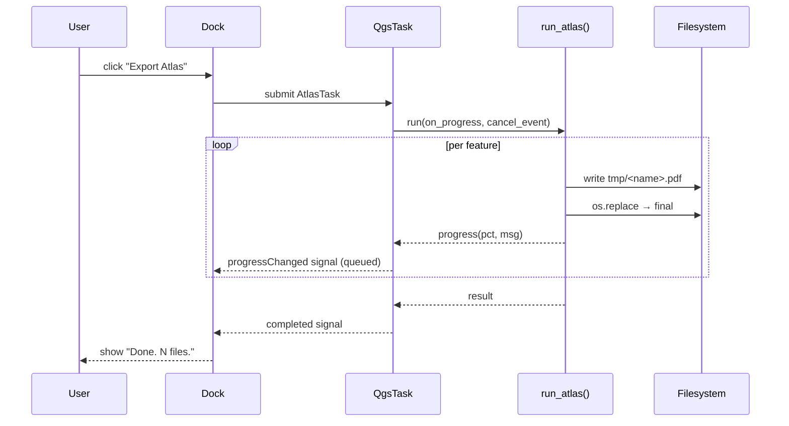
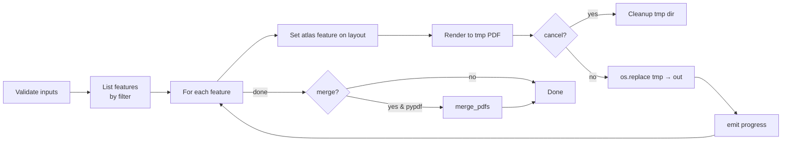
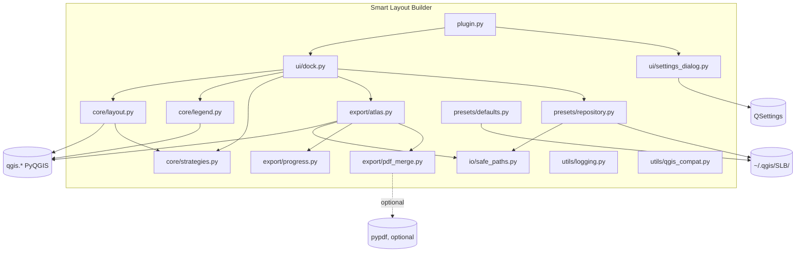

# Smart Layout Builder — Architecture (MVP-First Rewrite)

> **Status:** Active. Supersedes the original enterprise architecture.
> **Companion:** [`folder-structure.md`](folder-structure.md), [`api-design.md`](api-design.md), [`coding-standards.md`](coding-standards.md).
> **Philosophy:** Lean, flat, pragmatic. Optimized for shipping in 6–8 weeks and being maintained by 1–2 people for 5+ years.

---

## 1. Scope

This architecture covers **exactly three features**:

1. **Auto Layout Generator** — one button → balanced `QgsPrintLayout`.
2. **Smart Legend Cleaner** — prune hidden / out-of-extent / excluded layers.
3. **Sequential Atlas Export** — one PDF per coverage feature with great progress UX.

Everything else (AI, marketplace, cloud sync, adaptive layouts, dynamic text engine, custom template format, telemetry, multi-user, parallel atlas) is **out of scope** and not designed-for.

---

## 2. Architectural Principles

| # | Principle | What it means here |
|---|-----------|--------------------|
| P1 | **Flat over deep** | 6 packages, ≤ 2 levels of nesting. |
| P2 | **Direct PyQGIS, not abstracted** | Import `qgis.*` wherever it helps. No bridge layer. |
| P3 | **Functions and small classes** | Behavior lives in functions; classes only when they hold state. |
| P4 | **Files over tables** | JSON files + QSettings instead of SQLite. |
| P5 | **Qt signals over event buses** | Use what Qt already gives us. |
| P6 | **No public extension API** | Internal-only. Refactor freely until 1.0 is stable in the wild. |
| P7 | **No new abstractions without a second caller** | Strategy/registry/factory only when there are 2+ real instances. |
| P8 | **Errors are surfaced, not swallowed** | Typed exceptions with user-friendly messages. |
| P9 | **Long work runs on QgsTask** | UI never blocks; cancellation is honored. |
| P10 | **Atomic writes** | All output goes through temp file + `os.replace`. |

---

## 3. Layered Picture (only two layers)



That's the architecture. Two layers. No ports. No adapters. No domain/application split.

- **UI** owns widgets and signals only. Widget click → call a `core/` or `export/` function.
- **Core/export/presets** call PyQGIS directly and write JSON directly.

---

## 4. Plugin Lifecycle



### 4.1 Lifecycle Rules

- `__init__(iface)` stores `iface` and returns. No imports beyond minimum.
- `initGui()` registers toolbar + menu and creates the dock lazily on first show. Target **< 200 ms**.
- `unload()` disconnects every signal it connected, removes UI elements, and `deleteLater`s the dock.
- A `connections: list[tuple[Signal, Slot]]` attribute on the plugin class tracks every `signal.connect(slot)` so `unload()` can iterate and `disconnect`.

---

## 5. Module Responsibilities

### 5.1 `plugin.py` — the entry point

```
class SmartLayoutBuilder:
    iface
    toolbar_action
    menu_actions
    dock (lazy)
    connections (signal/slot tuples)

    initGui()    → register UI, wire signals, do NOT open dock
    unload()     → reverse of initGui
    show_dock()  → lazy-create + show
```

No business logic. No services held here other than the dock instance.

### 5.2 `ui/` — widgets only

| File | Owns |
|------|------|
| `ui/dock.py` | `SLBDock(QDockWidget)` with two tabs (Compose, Atlas) |
| `ui/settings_dialog.py` | `QDialog` for paper default + output folder default |
| `ui/designer/*.ui` | Optional Qt Designer files; compiled at build time |

Widgets:
- Hold references to inputs (combos, line edits, buttons).
- Emit Qt signals on user actions.
- Receive Qt signals to update progress / show errors.
- **Never** call SQLite, network, or filesystem directly. They call `core/`, `export/`, `presets/`.

### 5.3 `core/` — layout composition

| File | Owns |
|------|------|
| `core/layout.py` | `generate_layout(project, options) -> QgsPrintLayout` |
| `core/legend.py` | `prune_legend(layout, project, mode) -> int` |
| `core/strategies.py` | `two_column(paper_w, paper_h) -> list[ItemSpec]`, `single_column(...)` |

These are **functions**, not classes. They take inputs, return outputs, and are easy to test with a fixture `.qgz`.

`ItemSpec` is a plain `dict` (or `TypedDict`) with keys: `role`, `x_mm`, `y_mm`, `w_mm`, `h_mm`, `style`, `bindings`.

### 5.4 `export/` — atlas + per-feature export

| File | Owns |
|------|------|
| `export/atlas.py` | `run_atlas(...)` sequential loop over coverage features |
| `export/progress.py` | `AtlasProgressReporter(QObject)` with `progress(pct, msg)` signal |
| `export/pdf_merge.py` | Optional `merge_pdfs(paths, out)` — guarded by `pypdf` import |

The atlas function takes a **cancel flag** (`threading.Event` or simple callable) and a **progress callback**. The dock wraps it in a `QgsTask`.

### 5.5 `presets/` — preset CRUD

| File | Owns |
|------|------|
| `presets/repository.py` | `list_presets()`, `load_preset(name)`, `save_preset(name, data)`, `delete_preset(name)` |
| `presets/defaults.py` | `ensure_defaults_installed()` — copies bundled presets into user dir on first run |

Storage: `~/.qgis/SLB/presets/<name>.json`. One file per preset. Plain JSON. No ZIP, no migrations beyond a `"schema": 1` field.

### 5.6 `io/` and `utils/`

| File | Owns |
|------|------|
| `io/safe_paths.py` | User-dir helpers, atomic write (`write_atomic(path, bytes)`) |
| `utils/logging.py` | `logger = logging.getLogger("slb")`; rotating file handler |
| `utils/qgis_compat.py` | Small shims if a QGIS API drifted across LTRs (probably empty at start) |

---

## 6. Data & State

### 6.1 Where state lives

| State | Storage | Why |
|-------|---------|-----|
| Last-used paper, orientation, output folder, filename template, preset | `QSettings("SLB", "SLB")` | Native, per-profile, free |
| Saved presets | `~/.qgis/SLB/presets/*.json` | One file per preset; diff-friendly; user-inspectable |
| Bundled presets | `slb/resources/builtin_presets/*.json` | Read-only; copied to user dir on first run |
| Optional export history | `~/.qgis/SLB/history.jsonl` (Phase 1.1) | Append-only; trim by length |
| Logs | `~/.qgis/SLB/logs/slb.log` | RotatingFileHandler, 1MB × 3 |

### 6.2 What we do NOT have

- No SQLite.
- No migrations.
- No multi-user.
- No secret store (no API keys to store; if AI is ever added, it'll plug into `QgsAuthManager` or OS keyring then).
- No telemetry.

If we eventually need queries (analytics, deduplication), we add SQLite for *that* feature only. Not preemptively.

### 6.3 Preset JSON Shape

```json
{
  "schema": 1,
  "name": "Classic A4",
  "paper": "A4",
  "orientation": "portrait",
  "strategy": "single_column",
  "items": [
    {"role": "title",       "anchor": "top",          "h_mm": 12, "style": {"font_size_pt": 18}, "binding": "[%@project_title%]"},
    {"role": "map",         "fill": "center"},
    {"role": "legend",      "anchor": "bottom-left",  "w_mm": 80, "h_mm": 50},
    {"role": "scale_bar",   "anchor": "bottom",       "h_mm": 10},
    {"role": "north_arrow", "anchor": "bottom-right", "w_mm": 20, "h_mm": 20},
    {"role": "attribution", "anchor": "bottom",       "h_mm": 5}
  ]
}
```

The `schema` field exists so we can write a forward migrator later if needed. Today it does nothing.

---

## 7. Threading Model



Rules:
- **All long work** runs on `QgsTask`.
- **All Qt signal connections** that cross from worker to UI use `Qt.QueuedConnection` (or rely on `QgsTask`'s built-in main-thread delivery).
- **Cancellation** is cooperative: `run_atlas` checks `cancel_event.is_set()` between features.
- **No `threading.Thread`** outside `QgsTask` for anything that touches QGIS.

---

## 8. Atlas Export Design (Sequential, Safe)



- Sequential keeps memory predictable (single render at a time).
- Atomic writes (`tmp/` + `os.replace`) ensure no half-written PDFs.
- On cancel, the `tmp/` subfolder is deleted; already-finalized files remain.
- The PDF merge step uses optional `pypdf`. If unavailable, the merge UI element is hidden.

**Parallel atlas is explicitly deferred** to a post-1.0 spike. See [`risk-analysis.md`](review/risk-analysis.md) R-02 for why.

---

## 9. Smart Legend Cleaner Design

Two pruning modes:

| Mode | Rules | Default |
|------|-------|---------|
| `safe` | drop layers with `legendExcluded` property; drop layers invisible in the project tree | ✅ on by default |
| `extent` | also drop layers with **0 features** in the current map extent | opt-in via checkbox |

> **Revisi berbasis Spike S0.2** (lihat `docs/spikes.md`): rencana awal "timeout 50 ms
> per layer" **dibatalkan** — biaya cek ada di dalam satu panggilan provider C++ yang
> tidak bisa di-interrupt dari Python. Pengganti yang tervalidasi:
> 1. **bbox pre-filter** — transform `layer.extent()`; bila tak irisan dengan map extent
>    → prune tanpa scan fitur (nyaris gratis);
> 2. **budget kumulatif lintas-layer + fail-open** — bila total waktu uji melewati ~2 s,
>    hentikan dan keep sisa layer;
> 3. cek "ada ≥ 1 fitur" via iterator `break` (bukan `featureCount`), request
>    `NoGeometry` + subset atribut kosong;
> 4. transform extent project → CRS layer sebelum `setFilterRect`.
> Cold-start layer geometri-berat bisa ~140 ms sekali; sesudah index QGIS hangat < 1 ms.

Implementation outline:

```text
def prune_legend(layout, project, mode="safe"):
    items = legend_model_items(layout)  # via QgsLayoutItemLegend
    keep, drop = [], []
    for it in items:
        if it.legendExcluded:               drop.append(it); continue
        if not it.visible_in_project:       drop.append(it); continue
        if mode == "extent":
            if features_in_extent(it, timeout_ms=50) == 0:
                drop.append(it); continue
        keep.append(it)
    legend_model_set_items(layout, keep)
    return len(drop)
```

The function is **idempotent**: running it twice produces the same result.

For raster layers in `extent` mode: we treat "intersects bbox" as "in extent" (don't try to count pixels) — validated in Spike S0.2.
For layers that blow the cumulative time budget: we keep the layer (fail open, not closed — better to show too much than hide something useful).

---

## 10. Layout Composition Design

Two strategies for MVP. Both are **functions**, not subclasses:

### 10.1 `two_column(paper_w, paper_h, margin) -> list[ItemSpec]` (landscape default)

```
┌──────────────────────────────────────┐
│ Title (full width)                   │
├─────────────────────────┬────────────┤
│                         │ Legend     │
│         Map             │            │
│                         ├────────────┤
│                         │ Scale bar  │
│                         │ N arrow    │
├─────────────────────────┴────────────┤
│ Attribution                          │
└──────────────────────────────────────┘
```

### 10.2 `single_column(paper_w, paper_h, margin) -> list[ItemSpec]` (portrait default)

```
┌──────────────────────────────┐
│ Title                        │
├──────────────────────────────┤
│                              │
│            Map               │
│                              │
├──────────────────────────────┤
│ Legend  │ Scale  │ N. arrow  │
├──────────────────────────────┤
│ Attribution                  │
└──────────────────────────────┘
```

Each strategy returns a `list[ItemSpec]` of `dict`s with `role`, `x_mm`, `y_mm`, `w_mm`, `h_mm`. Anchor-based recomputation gives us "adaptive" behavior for free when the paper resizes: re-call the function.

**No constraint solver.** **No engine.** Two functions, ~80 LOC each.

---

## 11. Error Handling

```python
# slb/errors.py
class SLBError(Exception):
    """Base for all SLB user-facing errors."""
    def __init__(self, msg: str, *, hint: str = ""):
        super().__init__(msg)
        self.hint = hint

class ValidationError(SLBError): ...
class ExportError(SLBError): ...
class ExportCancelled(ExportError): ...
class PresetError(SLBError): ...
```

Rules:
- Domain raises `SLBError` subclasses with a friendly `msg` and an optional `hint`.
- UI catches `SLBError` and shows: `msg` headline, `hint` body, "Details…" expander with traceback (copy to clipboard).
- Unexpected exceptions are caught at the dock boundary, logged with traceback, and shown as a generic "Something went wrong" with a "Copy details" button.
- **Never** `except Exception: pass`.

---

## 12. Settings Resolution (Simple)

Two layers:

1. **Defaults** baked into the code (`DEFAULT_PAPER = "A4"`, etc.).
2. **`QSettings("SLB", "SLB")`** for user overrides.

That's it. No JSON config file. No system policy file. No project overrides. (Phase 2 may add project-level overrides via `QgsProject.customProperties()` *only if users ask*.)

Read pattern:

```python
def setting(key: str, default):
    return QSettings("SLB", "SLB").value(key, default)
```

---

## 13. Testing Strategy in One Page

| Test type | Where | What |
|-----------|-------|------|
| Unit | `tests/unit/` | Functions in `core/`, `export/`, `presets/`. Real Python, no QGIS. |
| Integration | `tests/integration/` | Real `QgsProject` fixture (`.qgz`). `generate_layout` + `prune_legend` + `run_atlas` end-to-end on a 5-feature coverage. |
| Smoke (CI) | `tests/smoke/` | Plugin loads in headless QGIS; dock opens; one layout generated. |

- CI: **Linux only**, **latest QGIS LTR only**, PyQt5. Add OS+LTR matrix post-1.0 if needed.
- Coverage: tracked, **not gated**. Aim 60% by 1.0, 70% by 1.2.
- **No** golden-PDF tests (too brittle across platforms).
- **No** mutation/property-based testing in MVP.

See [`testing-strategy.md`](testing-strategy.md) for the longer version (kept short).

---

## 14. Internationalization

- Wrap user-visible strings in `self.tr(...)` from day 1 (good hygiene; ~zero cost).
- Ship **English only** at 1.0.
- Add `.ts` / `.qm` pipeline (`pylupdate5` + `lrelease`) *when* a translator volunteers.
- Tooltips, error messages, button labels all wrapped.

---

## 15. Performance Budgets (Honest)

| Budget | Target | How measured |
|--------|--------|--------------|
| Plugin import | "no perceptible delay" vs. unloaded QGIS startup | manual timing; document baseline once |
| Dock open | < 300 ms | first paint after click |
| Layout generation (10-layer project) | < 3 s | wall clock |
| Atlas (56 features, A3 vector PDF) | "at least as fast as native QGIS, with better UX" | side-by-side comparison |

We **do not** promise specific numbers like "500 atlas pages in 10 minutes" without first measuring them. Performance numbers are committed only after a baseline exists.

---

## 16. Logging

- Stdlib `logging`, one logger per module: `logger = logging.getLogger(__name__)`.
- Console handler at `WARNING` for QGIS console.
- File handler at `INFO` → `~/.qgis/SLB/logs/slb.log` (RotatingFileHandler 1 MB × 3).
- DEBUG when env `SLB_DEBUG=1`.
- Never log secrets, full home paths (replace `~`), or full project content.

---

## 17. Extensibility (Deliberately Minimal)

The plugin **does not expose a public Python API** in MVP. Everything is `_internal`. Refactoring is free.

If someone asks for an extension point post-1.0 with a concrete use case, we design *for that case* — not preemptively.

---

## 18. What This Architecture Is Not

To set expectations:

- ❌ Not hexagonal. Not Clean. Not Onion.
- ❌ No DI container.
- ❌ No event bus, command bus, mediator, or service locator.
- ❌ No domain/application/infrastructure separation.
- ❌ No abstract base classes for "future providers".
- ❌ No SQLite.
- ❌ No AI subsystem.
- ❌ No marketplace, cloud sync, telemetry.
- ❌ No `.slbtmpl` custom format.
- ❌ No constraint solver.

If any of these become necessary later — because real users hit a real wall — we add them then. *And only the one that's needed.*

---

## 19. Why This Is The Right Architecture (Now)

1. **Maintainable solo.** A new contributor (or future-you in 18 months) can read the codebase in a single sitting.
2. **Shippable in 6–8 weeks.** No architectural pre-work; week 1 produces a real layout.
3. **Low risk.** No untested patterns; no parallel atlas; no PyQGIS misuse.
4. **Open to evolution.** Adding a feature later is adding files, not redesigning layers.
5. **In the company of healthy plugins.** This shape matches [QuickMapServices], [DataPlotly], [Profile Tool] — plugins that have lasted.

---

## 20. Component Diagram (Final)



That's the whole plugin.

---

*End of architecture.md (lean rewrite).*
