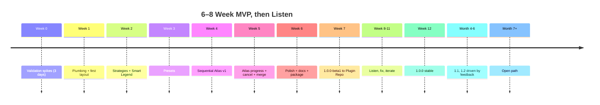

# Smart Layout Builder — Development Roadmap (MVP Rewrite)

> **Status:** Active. Supersedes the original 12-month enterprise roadmap.
> **Philosophy:** Ship a small, focused, useful plugin in 6–8 weeks. Earn the right to be ambitious only after real users speak.

---

## 1. Roadmap at a Glance

**No commitments past month 6.** Beyond that, the roadmap is determined by real user feedback, not pre-planning.

---

## 2. Phase 0 — Validation Spikes (Week 0, ~3 days)

Before writing production code, prove the risky parts.

| Spike | Question | Pass criteria | Time |
|-------|----------|---------------|------|
| **S0.1** | Can we produce a balanced `QgsPrintLayout` programmatically in < 200 LOC? | Yes → green-light `core/layout.py` direction. | 1 day |
| **S0.2** | Can we count features in extent for mixed vector/raster/WFS layers fast enough (< 50 ms per layer)? | Mostly yes → opt-in extent pruning is safe to ship. | 1 day |
| **S0.3** | Can sequential atlas export a 5-feature fixture to 5 PDFs in < 30 s, with cancel & atomic writes? | Yes → MVP atlas approach viable. | 1 day |

**Deliverables:**
- 3 throwaway branches with proof-of-concept code.
- A short `spikes.md` note in `docs/` recording findings.
- Go/no-go decision documented.

**If any spike fails:** stop and redesign the affected feature *before* committing to the schedule. Saving 1 day of investigation here saves 4 weeks of rework later.

---

## 3. Phase 1 — MVP (Weeks 1–6)

### Theme

> *Auto Layout + Smart Legend + Sequential Atlas. Nothing else.*

### Week-by-Week Plan

#### Week 1 — Plumbing + first layout

| Day | Deliverable |
|-----|-------------|
| Mon | Repo bootstrap: `slb/__init__.py`, `metadata.txt`, `plugin.py`, basic CI (ruff + pytest on Linux). |
| Tue | Toolbar action + empty dock; load/unload cleanly under Plugin Reloader. |
| Wed | `core/layout.generate_layout()` minimum: produces a `QgsPrintLayout` with map + title. |
| Thu | Add legend, scale bar, north arrow, attribution items. |
| Fri | Dock "Generate Layout" button works end-to-end; opens layout in QGIS Designer. |

**Demo milestone:** End of week, show a real GIS user. Collect 3 reactions.

#### Week 2 — Composition strategies + Smart Legend v1

| Day | Deliverable |
|-----|-------------|
| Mon | `core/strategies.py` — `two_column()` + `single_column()` functions. |
| Tue | Paper + orientation selectors in dock; generation routes to correct strategy. |
| Wed | `core/legend.prune_legend()` — `safe` mode (visibility + LegendExcluded). |
| Thu | Add `extent` mode (opt-in checkbox). |
| Fri | Idempotency + safety tests for legend cleaner. |

#### Week 3 — Presets

| Day | Deliverable |
|-----|-------------|
| Mon | `presets/repository.py` — list/load/save/delete with JSON files. |
| Tue | Bundled presets in `slb/resources/builtin_presets/`; `defaults.ensure_defaults_installed()`. |
| Wed | Dock preset dropdown + Save/Save As/Delete buttons. |
| Thu | `ui/settings_dialog.py` — 2 fields (default paper, default output folder). |
| Fri | Bug fixes; first integration test with a real `.qgz` fixture. |

#### Week 4 — Atlas v1 (sequential, no progress UI yet)

| Day | Deliverable |
|-----|-------------|
| Mon | `export/atlas.run_atlas()` — sequential loop over coverage features. |
| Tue | Filename template parsing (`peta_[%kelurahan%].pdf`) + sanitization. |
| Wed | Atlas tab UI: coverage selector, filter, output, filename, start button. |
| Thu | Atomic temp writes; basic error surfacing. |
| Fri | Integration test: 5-feature fixture → 5 PDFs. |

#### Week 5 — Atlas v2: progress + cancel + merge

| Day | Deliverable |
|-----|-------------|
| Mon | `export/progress.py` — QObject with `progress(pct, msg)` and `finished(dict)` signals. |
| Tue | Wrap `run_atlas` in a `QgsTask`; wire progress to dock UI. |
| Wed | ETA from rolling average of per-feature time. |
| Thu | Cancellation works; partial outputs cleaned. |
| Fri | Optional `pypdf` import + merge checkbox; hides if not installed. |

#### Week 6 — Polish + docs + package

| Day | Deliverable |
|-----|-------------|
| Mon | Tooltips, empty states, error dialogs with actionable hints. |
| Tue | Input validation (folder writability, filename collisions). |
| Wed | README + USAGE.md + 4 screenshots. |
| Thu | `scripts/package.py` produces installable ZIP. |
| Fri | Submit to QGIS Plugin Repo as `experimental=True` → tag `1.0.0-beta1`. |

### Week 6 Exit Criteria

- [ ] Plugin installs cleanly into a fresh QGIS profile via the ZIP.
- [ ] Plugin loads in < 300 ms (measured).
- [ ] User generates a layout in < 3 s on a 10-layer project.
- [ ] Smart Legend pruning works in both modes.
- [ ] User saves & reloads a preset across QGIS restart.
- [ ] User runs atlas on a 56-feature coverage → 56 PDFs produced.
- [ ] Progress bar updates and ETA is roughly accurate.
- [ ] Cancel leaves no half-written PDFs.
- [ ] Optional merge produces a single PDF with N pages.
- [ ] Unload removes all toolbar/menu/dock elements; no signal leaks under Plugin Reloader.
- [ ] README + USAGE.md let a new user complete the flow without asking for help.

If any item fails → fix before tagging 1.0.0-beta1.

---

## 4. Phase 2 — Listen & Iterate (Weeks 7–12)

### Theme

> *Don't build. Listen.*

### Week 7 — Beta release activities

| Action | Detail |
|--------|--------|
| Plugin Repo experimental | Tag `v1.0.0-beta1`. |
| Announce on QGIS forum | Honest single post. |
| Personal outreach | Email 5 known GIS users; offer 30-min feedback calls. |
| Open GitHub Discussions | Encourage feedback here, not just Issues. |
| Set up bug triage cadence | 1 hour/week, fixed slot. |

### Weeks 8–10 — Bug fixes + small wins

- Cut `1.0.0-rc1` after fixing CRITICAL/HIGH bugs.
- Then `1.0.0` stable when no CRITICAL is open.
- Label backlog: `bug-1.0`, `wishlist-1.1`, `future`, `wontfix`.

### Weeks 11–12 — 1.1 features driven by feedback

Build only what users actually asked for. Strong candidates (anticipated):

| Candidate | Why likely requested |
|-----------|----------------------|
| Inset map item | Frequently used in atlases |
| Atlas resume after crash | Sequential is safe but long runs need it |
| PNG output for atlas | Common ask alongside PDF |
| Indonesian translation | First user pull was likely Indonesia (BPBD persona) |
| Export history pane | Users like seeing past jobs |
| Grid + grid labels item | Cartography essential many users will miss |
| "Open in Designer after generate" toggle | UX preference |

**Don't pre-commit.** Use issue thumbs-ups / reactions to rank.

### 1.1 Release

End of week 12. Tag `v1.1.0`. Stable, not experimental.

---

## 5. Phase 3 — Selective Phase-2 Features (Months 4–6)

By month 4, the maintainer has data about:
- Who the users are.
- What they actually use.
- Where the friction is.

Pick **at most two** features to add in 1.2:

| Candidate | Worth doing if… |
|-----------|-----------------|
| Anchor-based "adaptive" layout | Users hit broken layouts on paper-size changes |
| Static layout preview thumbnail | Users say round-tripping to Designer slows them |
| Small dynamic-text token set (5–10 tokens) | Users need data unavailable via `[% %]` |
| Atlas parallelism (experimental flag, ≤ 2 workers) | Users report time pressure on big atlases |

Tag `v1.2.0` at end of month 6.

**Important.** If everything's a priority, nothing is. Pick two. The rest stays in the backlog.

---

## 6. Phase 4 — Open Path (Month 7+)

Beyond month 6 the roadmap is intentionally undefined. Possible directions and the bar each must clear:

| Direction | Greenlight criteria | Don't pursue if… |
|-----------|--------------------|------------------|
| AI Assistant | Repeated, concrete user requests with use cases | "It would be cool" |
| Report Builder | Multiple users hack around composing multi-section PDFs | One user asks once |
| Template package format | Org users want to distribute layouts internally | Solo users tolerate JSON files |
| Processing provider / CLI | Users want headless atlas in CI pipelines | Nobody asks |

**Capacity check.** If maintainer capacity is < 4 hours/week, do **none** of these. Maintain 1.x and prune the backlog.

---

## 7. Explicitly Removed from the Roadmap

These are **not** on the path forward unless future signal explicitly demands them:

- ❌ Template marketplace + index server
- ❌ Cloud sync (Git / S3 / WebDAV)
- ❌ Multi-user features
- ❌ Telemetry backend
- ❌ Ed25519 signing infrastructure
- ❌ Reproducible build verification
- ❌ Vision / screenshot AI upload
- ❌ "Live collaboration" / WebSocket sessions
- ❌ Custom constraint solver
- ❌ Multi-provider AI abstraction
- ❌ Custom `.slbtmpl` archive format

If any returns to the roadmap, it requires:
- A documented user request.
- Available maintainer capacity.
- A simpler alternative considered and rejected.

---

## 8. Milestones Calendar

| Anchor | Event | Tag |
|--------|-------|-----|
| Week 0 | Validation spikes | — |
| Week 6 | MVP complete; Plugin Repo submission | `v1.0.0-beta1` |
| Week 9 | First stable release | `v1.0.0` |
| Week 12 | First user-driven minor | `v1.1.0` |
| Month 6 | Second user-driven minor | `v1.2.0` |
| Month 9 | Re-evaluate roadmap with maintainer + users | — |

All dates relative to project kickoff.

---

## 9. Definition of Done (per release)

For every tagged release:

- [ ] `metadata.txt` version bumped.
- [ ] `slb/version.py` updated.
- [ ] `CHANGELOG.md` entry under correct version.
- [ ] All CI green.
- [ ] All CRITICAL bugs closed.
- [ ] HIGH bugs either closed or documented as known issues.
- [ ] README + USAGE updated for any user-visible change.
- [ ] Git tag created.
- [ ] ZIP packaged via `scripts/package.py`.
- [ ] Plugin Repo upload accepted.

---

## 10. Cadence Discipline

| Cadence | Activity |
|---------|----------|
| Weekly (1h) | Bug triage |
| Monthly | Patch or minor release (never both same week) |
| Quarterly | Roadmap re-evaluation against real user signal |
| Per-bug-fix | Add a regression test, even tiny |

---

## 11. Capacity Estimates (Honest)

| Team shape | Realistic time to MVP |
|------------|-----------------------|
| 1 maintainer, 5 hrs/week | 14–18 weeks |
| 1 maintainer, 15 hrs/week | 7–9 weeks |
| 1 maintainer, 30 hrs/week | 5–6 weeks |
| 2 maintainers, 10 hrs/week each | 6–8 weeks |
| 2 maintainers, 20 hrs/week each | 4–5 weeks |

Pick your shape. The 6–8 week target assumes ~20 hrs/week for one person or two people sharing.

---

## 12. Risk Reviews per Phase

Per release, reassess the top 5 risks from [`review/risk-analysis.md`](review/risk-analysis.md):

| Phase | Top 5 risks to check |
|-------|-----------------------|
| 0 (Spikes) | Atlas feasibility, legend perf, layout API drift |
| 1 (MVP) | Architecture creep, scope creep, signal cleanup, atomic writes |
| 2 (Listen) | Maintainer burnout, adoption stall, bug backlog growth |
| 3 (1.2) | Parallel atlas safety (if attempted), feature creep |
| 4+ (Open) | Maintainer capacity, scope discipline |

A bi-monthly maintainer reflection ("what changed in the top 3?") keeps the project honest.

---

## 13. Honest Failure Plans

If at any point the project hits a wall:

| Failure | Response |
|---------|----------|
| Spike S0.3 reveals atlas can't be done safely | Pivot MVP to Auto Layout + Smart Legend only |
| Week 6 isn't ready | Slip to week 8, don't ship broken |
| 1.0 adoption stalls at < 100 installs/month | Stop building; outreach. Don't more-features your way to adoption |
| Maintainer can't continue | Hand off. Don't carry it alone past the burnout line |
| QGIS LTR ships a feature that obsoletes us | Pivot to differentiator (Smart Legend, batch UX) |

---

## 14. Bottom Line

| Original Plan | Rewrite |
|---------------|---------|
| 12-month, 4-phase commitment | 6–8 weeks to beta; open beyond month 6 |
| Release calendar through 2.0 | Releases ≤ 1.2 named in advance |
| 14 features planned for 12 months | 3 features for 1.0; rest from real signal |
| Phases lock features by date | Phases drive validation; features driven by users |

Build a working plugin. Show it to people. Listen. Then build the next thing. That's the roadmap.

---

*End of development-roadmap.md (lean rewrite).*
