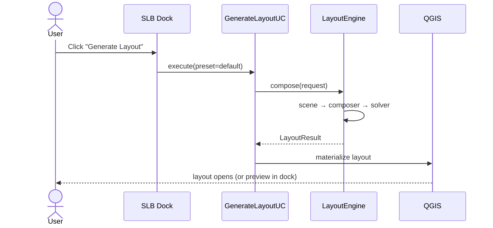
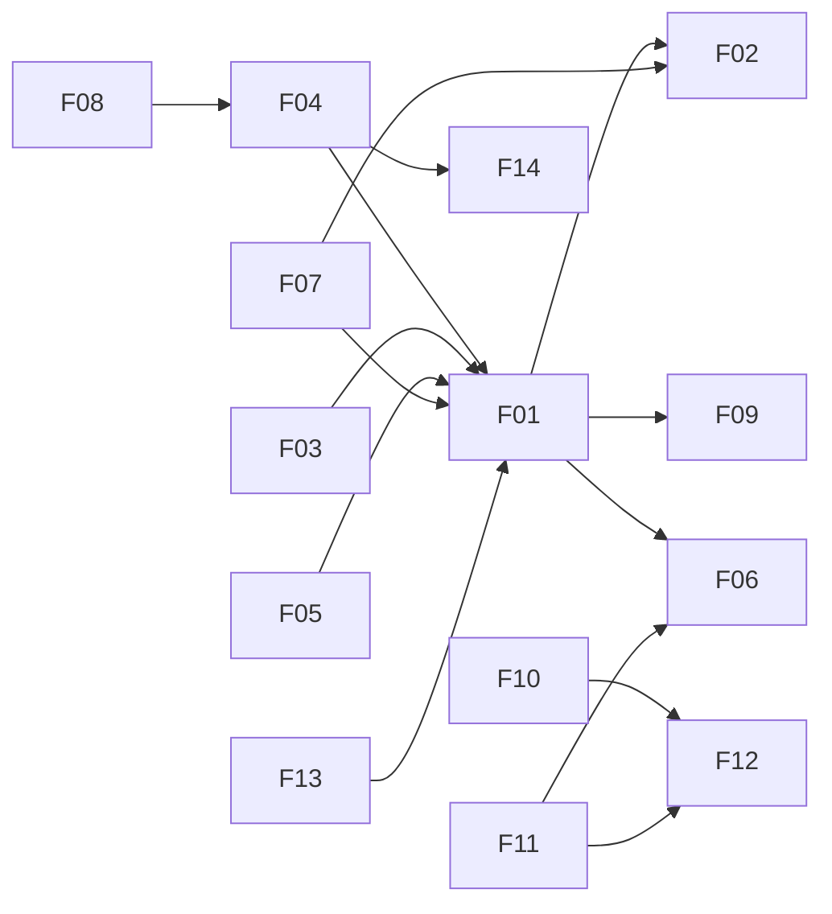

# Smart Layout Builder — Feature Specification

> **Companion to:** [`plan.md`](plan.md), [`architecture.md`](architecture.md), [`ui-ux.md`](ui-ux.md)
> **Effort scale:** XS (≤1d), S (1–3d), M (1w), L (2–3w), XL (1m+)

---

## Feature Index

| # | Feature | Phase | Priority | Effort |
|---|---------|-------|----------|--------|
| F01 | [Auto Layout Generator](#f01--auto-layout-generator) | MVP | P0 | L |
| F02 | [Smart Legend Cleaner](#f02--smart-legend-cleaner) | MVP | P0 | M |
| F03 | [Adaptive Layout System](#f03--adaptive-layout-system) | Phase 2 | P1 | L |
| F04 | [Batch Atlas Export](#f04--batch-atlas-export) | MVP | P0 | L |
| F05 | [Dynamic Text Engine](#f05--dynamic-text-engine) | Phase 2 | P1 | M |
| F06 | [Layout Presets](#f06--layout-presets) | MVP | P0 | M |
| F07 | [AI Layout Assistant](#f07--ai-layout-assistant) | Phase 3 | P2 | XL |
| F08 | [Report Export](#f08--report-export) | Phase 4 | P2 | L |
| F09 | [Preview System](#f09--preview-system) | MVP | P0 | M |
| F10 | [Template Marketplace](#f10--template-marketplace-future) | Phase 4 | P3 | XL |
| F11 | [Cloud Sync](#f11--cloud-sync-future) | Phase 4 | P3 | L |
| F12 | [Template Manager](#f12--template-manager) | MVP | P0 | M |
| F13 | [Onboarding Wizard](#f13--onboarding-wizard) | MVP | P1 | S |
| F14 | [Export History](#f14--export-history) | MVP | P1 | S |

---

## F01 — Auto Layout Generator

### Description

Generates a complete, balanced `QgsPrintLayout` from the current QGIS project state with a single action. Reads active layers, current map canvas extent, project CRS, and a chosen preset (or default), then composes a layout with map, title, legend, scale bar, north arrow, attribution, and optional inset.

### User Flow

### Acceptance Criteria

- ✅ Produces a valid `QgsPrintLayout` named `SLB <Project> <YYYY-MM-DD HH:mm>`.
- ✅ Map item shows current canvas extent.
- ✅ Legend contains only **visible** layers in extent.
- ✅ Scale bar uses map units and is right-aligned by default.
- ✅ Title binds to `[%@project_title%]` (or preset override).
- ✅ Action is undoable (single QGIS undo step removes the layout).
- ✅ Works on a project with 0 layers (renders a friendly empty-state map).
- ✅ Works on a project with 200 layers without UI freeze (background task).

### Technical Complexity

- Constraint solving for collision-free placement.
- Determining legend grouping (by theme vs. by layer order).
- Computing optimal scale-bar segments from rounded "nice" numbers.
- Choosing north-arrow rotation from project CRS true north (for projected CRSs).

### Dependencies

- `domain/engine/layout_engine.py`
- `domain/engine/legend_curator.py` (F02)
- `domain/engine/composer.py`
- `infrastructure/qgis_adapter/layout_factory.py`

### MVP / Future

- **MVP:** Grid strategy, A4/A3 portrait+landscape, all default items.
- **Future:** Editorial / minimal strategies (Phase 2), AI strategy (Phase 3).

### Estimated Effort

**L (2–3 weeks)** — pipeline + solver + materializer + tests.

---

## F02 — Smart Legend Cleaner

### Description

Prunes the legend of layers that are:
- Hidden in the layer panel.
- Outside the map extent (zero features visible).
- Marked as "exclude from legend" in layer properties.
- Duplicate of a group (when a group is already present).

Also: collapses raster categories with zero pixels, merges sibling vector categories with identical symbology, and truncates labels exceeding a configurable length with `…`.

### User Flow

1. Triggered automatically by F01.
2. Also exposed as a standalone action ("Clean legend of current layout").
3. User can preview a diff (✕ removed / ➕ kept) before applying.

### Acceptance Criteria

- ✅ Removes hidden layers from the legend.
- ✅ Removes layers with zero visible features in extent.
- ✅ Removes `LegendExcluded` layers (QGIS layer property).
- ✅ Preserves manual user edits when re-run (idempotent rules; manual additions tagged with a custom property).
- ✅ Provides a dry-run preview.
- ✅ Reversible (`Ctrl+Z`).

### Technical Complexity

- Visibility-in-extent requires per-layer feature count with spatial filter — must be **fast** (use indices, abort early).
- Idempotency across re-runs.

### Dependencies

- `domain/engine/legend_curator.py`
- `infrastructure/qgis_adapter/bridge.py` (feature count helpers)

### MVP / Future

- **MVP:** Hidden + out-of-extent + LegendExcluded.
- **Future:** Category-level pruning, AI-suggested grouping.

### Estimated Effort

**M (1 week)**.

---

## F03 — Adaptive Layout System

### Description

Layouts respond to changes — paper resize, orientation flip, content addition/removal, or project CRS change — by recomputing item geometry, not just naively stretching. Driven by a **constraint graph** stored on the layout.

### User Flow

1. User flips A4 portrait → A3 landscape from the dock.
2. SLB recomputes item geometry preserving relative proportions and minimum sizes.
3. Items that no longer fit are **gracefully demoted** (e.g., legend wraps to 2 columns) or **promoted** (e.g., map gains the freed space).

### Acceptance Criteria

- ✅ Resize from A4 → A3 preserves visual balance.
- ✅ Orientation flip swaps width/height constraints, not just rotates.
- ✅ Adding a layer triggers legend re-flow.
- ✅ Constraints serialize into the layout XML (round-trip safe).

### Technical Complexity

- Implementing a lightweight constraint solver (cassowary-style or simple two-pass).
- Defining the constraint vocabulary (`pin-to-edge`, `align`, `min-size`, `aspect-ratio`).
- Persisting constraints inside `QgsPrintLayout` custom properties.

### Dependencies

- `domain/engine/adaptive_engine.py`
- `domain/engine/constraint_solver.py`
- F01 (must compose constraints when generating).

### MVP / Future

- **MVP:** Not included. Default to "regenerate from preset" behavior.
- **Phase 2:** Real adaptive engine.

### Estimated Effort

**L (2–3 weeks)**.

---

## F04 — Batch Atlas Export

### Description

Drives QGIS atlas export over a coverage layer, producing one PDF/PNG/SVG per feature (or filtered subset), with parallel rendering and progress reporting. Supports filename templates, per-feature title expressions, and post-processing (merge / index PDF).

### User Flow

### Acceptance Criteria

- ✅ Renders one file per feature with filename from expression (e.g., `map_[%kelurahan%].pdf`).
- ✅ Parallel: defaults to `min(CPU, 8)` workers; configurable.
- ✅ Progress bar with ETA, cancellable.
- ✅ Resume: if interrupted, skip already-written files.
- ✅ Optional: merge all into one PDF with bookmarks per feature.
- ✅ Validates: no filename collisions; writable output dir; coverage layer has features.
- ✅ Memory bounded (does not load all pages at once).

### Technical Complexity

- QGIS atlas is **single-threaded** natively. We slice the coverage into N subsets and run N independent layouts → N temp PDFs → merge.
- Each subset gets its own atlas with `coverage filter` set to the slice.
- Merging PDFs with bookmarks (PyPDF2 / pypdf).
- Synchronizing progress across workers safely.

### Dependencies

- `io/exporters/atlas_orchestrator.py`
- `io/exporters/pdf_merger.py`
- `services/export_service.py`
- `infrastructure/qgis_adapter/task_runner.py`

### MVP / Future

- **MVP:** PDF + PNG, parallel, progress, cancel, merge.
- **Future:** GeoPDF, SVG, watermarking, per-feature template selection.

### Estimated Effort

**L (2–3 weeks)**.

---

## F05 — Dynamic Text Engine

### Description

A token system layered on top of QGIS expressions: `[%@slb.kelurahan_count%]`, `[%@slb.scale_human%]`, `[%@slb.date(format='id-ID', style='long')%]`. Provides:

- A **discoverable token catalog** with descriptions, examples, and live preview.
- **Custom tokens** registered via Python (extensibility).
- **Token picker UI** (autocomplete + insert).
- **Inline preview** in text item editors.

### User Flow

1. User edits a layout text item.
2. Clicks "Insert dynamic text…" → token picker opens.
3. Filters tokens, sees live preview using current project data.
4. Inserts; text item now contains `[%@slb.…%]`.

### Acceptance Criteria

- ✅ At least 30 built-in tokens covering: project meta, CRS, extent, atlas feature, date/time, statistics.
- ✅ Token picker with search, preview, and insertion.
- ✅ Custom tokens registered via `register_token('foo', resolver_fn)`.
- ✅ Tokens evaluated lazily at render time (no stale values).
- ✅ Compatible with native QGIS expression engine (does not break `[% %]`).

### Technical Complexity

- Hooking the QGIS expression engine without forking it (uses `qgsfunction` registration).
- Performance: tokens must be cheap (cached per render).
- Testing dynamic evaluation without rendering.

### Dependencies

- `domain/engine/dynamic_text.py`
- `infrastructure/qgis_adapter/bridge.py`
- `ui/widgets/token_picker.py`

### MVP / Future

- **MVP:** Not included (uses native `[% %]`).
- **Phase 2:** Full engine.

### Estimated Effort

**M (1 week)** for engine; **+S** for UI.

---

## F06 — Layout Presets

### Description

A **preset** is a named, reusable layout configuration: paper, margins, included items, item styles, expression bindings, and assigned strategy. Presets live in SQLite and can be exported as JSON.

### User Flow

1. User configures a layout in the Compose tab.
2. Clicks "Save as preset" → names it.
3. Next time, picks it from the preset dropdown → one-click apply.
4. Can share presets via "Export…" / "Import…" JSON.

### Acceptance Criteria

- ✅ Create, rename, duplicate, delete presets.
- ✅ Default presets ship with the plugin (A4 classic, A3 editorial, Letter minimal, Indonesia-Govt).
- ✅ Presets are **versioned** (schema version + content hash).
- ✅ Mark as favorite (sorted to top).
- ✅ Import/export single preset or batch.

### Technical Complexity

- Schema design that's forward-compatible.
- Migration when schema evolves.

### Dependencies

- `io/presets/repository.py`
- `infrastructure/storage/sqlite_adapter.py`
- `domain/entities/preset.py`

### MVP / Future

- **MVP:** Full preset CRUD, defaults, import/export.

### Estimated Effort

**M (1 week)**.

---

## F07 — AI Layout Assistant

### Description

Provider-pluggable AI assistant that proposes layout improvements, suggests legend grouping, recommends presets/templates for given content, and answers free-form cartographic questions ("Why does my map feel cluttered?").

### User Flow

1. User opens AI tab.
2. Picks an action: *Suggest layout*, *Audit composition*, *Optimize legend*, *Free chat*.
3. SLB constructs a sanitized prompt + project snapshot (no PII).
4. Provider responds with structured JSON conforming to a schema.
5. SLB validates, presents the suggestion, user can apply or dismiss.

### Acceptance Criteria

- ✅ Provider abstraction: OpenAI, Anthropic, Azure-OpenAI, Ollama (local).
- ✅ All AI output validated against JSON Schema before use.
- ✅ Prompts versioned in `ai/prompts/`.
- ✅ Token-budget and daily-cost ceiling enforced.
- ✅ Cached responses (configurable TTL).
- ✅ Sanitizer strips file paths, hostnames, user names from project context.
- ✅ Works offline (Ollama) with degraded quality.
- ✅ Graceful failure: if AI fails, deterministic fallback proceeds.

### Technical Complexity

- Prompt engineering for stable structured output.
- Schema validation + retry strategy.
- Sanitization (regex + structural redaction).
- Provider differences (system prompt, tool calling, streaming).

### Dependencies

- `ai/providers/*`
- `ai/sanitizer.py`
- `ai/cache/ai_cache.py`
- `ai/prompts/*`

### MVP / Future

- **MVP:** Not included.
- **Phase 3:** Full implementation.

### Estimated Effort

**XL (1+ month)**.

---

## F08 — Report Export

### Description

Produces a **multi-section deliverable** combining: a cover page, an executive summary, the atlas pages, and a data appendix (tables of attributes, optional charts). Output is a single bookmarked PDF.

### User Flow

1. User opens Report builder.
2. Configures: cover (title, subtitle, logo, date), summary (rich-text), atlas (F04), appendix (selected attribute tables).
3. Clicks Build.
4. Receives PDF with bookmarks: `Cover → Summary → Atlas/<feature> → Appendix`.

### Acceptance Criteria

- ✅ Single PDF output.
- ✅ Bookmarks navigable.
- ✅ Page numbers continuous and properly skipped on cover.
- ✅ Logo + title configurable from preset.
- ✅ Appendix tables paginate correctly.

### Technical Complexity

- Composing PDFs from heterogeneous sources.
- Page-numbering logic across sections.
- Long-table pagination (could leverage ReportLab or similar).

### Dependencies

- F04 (atlas).
- New: `io/exporters/report_orchestrator.py`.

### MVP / Future

- **MVP:** Not included.
- **Phase 4:** Implemented.

### Estimated Effort

**L (2–3 weeks)**.

---

## F09 — Preview System

### Description

Inline, live-updating preview of the current layout inside the dock panel — no need to open the Layout Designer. Re-renders on debounce (300ms) after any input change.

### User Flow

1. User opens Compose tab.
2. Bottom half shows the preview.
3. Changing preset / paper / extent triggers a re-render (debounced).

### Acceptance Criteria

- ✅ Renders preview at ≥ 24 fps when interactively dragging.
- ✅ Uses thumb cache for unchanged regions.
- ✅ Click on preview → opens full Layout Designer with the same layout.
- ✅ Hover on preview shows item names (debug overlay; toggleable).

### Technical Complexity

- Fast render path (lower DPI, simplified symbology when interactive).
- Cache invalidation.
- Stable across QGIS rendering API versions.

### Dependencies

- `ui/widgets/live_preview.py`
- `application/render_preview.py`

### MVP / Future

- **MVP:** Static preview (regenerate on demand).
- **Phase 2:** Live debounced preview.

### Estimated Effort

**M (1 week)**.

---

## F10 — Template Marketplace (Future)

### Description

A curated, community-driven registry of `.slbtmpl` templates browsable inside the plugin. Each template has metadata (author, license, screenshots, version, downloads, rating).

### User Flow

1. User opens Templates tab → Browse Marketplace.
2. Filters by category, license, language.
3. Previews; one-click install (downloads + verifies signature).
4. Optional: rate, comment, report.

### Acceptance Criteria

- ✅ Index server URL configurable.
- ✅ Signed templates (Ed25519); unsigned ones flagged.
- ✅ Sandboxed install (verify ZIP, check schema, no code execution).
- ✅ Local cache + offline browse.
- ✅ Self-hosting option for orgs.

### Technical Complexity

- Trust model (signatures, signers).
- Sandbox.
- Index server (separate project).

### Dependencies

- F12 (Template Manager).

### MVP / Future

- **MVP:** Not included.
- **Phase 4:** Implemented.

### Estimated Effort

**XL** (plugin side ~2w; index server ~3w).

---

## F11 — Cloud Sync (Future)

### Description

Syncs an organization's templates and presets across machines via Git or S3-compatible storage. Supports pulling, pushing, and conflict resolution.

### User Flow

1. Admin configures a Git URL / S3 bucket.
2. Plugin pulls on launch (if connectivity).
3. On save, plugin pushes (if user has write).
4. Conflict: present diff, ask user.

### Acceptance Criteria

- ✅ Pluggable transport (Git, S3, WebDAV).
- ✅ Read-only mode (consumers).
- ✅ Last-writer-wins with explicit conflict UI.
- ✅ Encrypted credentials in OS keyring.

### Technical Complexity

- Conflict resolution UX.
- Auth flows.
- Offline reconciliation.

### Dependencies

- F12 (Template Manager).
- F06 (Presets).

### MVP / Future

- **MVP:** Not included.
- **Phase 4:** Implemented.

### Estimated Effort

**L (2–3 weeks)**.

---

## F12 — Template Manager

### Description

Manage `.slbtmpl` templates: install, uninstall, enable/disable, lock, version. Templates can be **shipped**, **user-installed**, **org-managed**.

### User Flow

1. Templates tab lists all installed templates with badges (shipped / user / org).
2. Right-click → enable / disable / show in file manager / inspect manifest.
3. Drag a `.slbtmpl` onto the panel → installs.

### Acceptance Criteria

- ✅ Three sources clearly labeled.
- ✅ Locked templates cannot be deleted or edited (org policy).
- ✅ Conflicts on install (same name, different version) → user picks.
- ✅ Schema validation + migration on install.

### Technical Complexity

- ZIP safety (zip-slip).
- Migration framework.
- Locking semantics.

### Dependencies

- `io/templates/*`

### MVP / Future

- **MVP:** Yes (install/uninstall/list).
- **Phase 2:** Locking + migration UX.

### Estimated Effort

**M (1 week)**.

---

## F13 — Onboarding Wizard

### Description

A first-run wizard that introduces SLB in 4 pages: welcome, generate first layout, atlas demo, settings.

### User Flow

1. First launch detects no `~/.qgis/SLB/`.
2. Wizard opens with 4 simple pages.
3. Step "Generate first layout" runs on a sample project.
4. Concludes by opening the dock with a tooltip tour.

### Acceptance Criteria

- ✅ Skippable.
- ✅ Re-runnable from Settings → "Show Welcome Tour".
- ✅ Localized.

### Estimated Effort

**S (1–3 days)**.

---

## F14 — Export History

### Description

A log of all exports (layout, atlas, report) with timestamps, outputs, duration, status, settings snapshot. Click an entry to **re-run** with the same settings.

### User Flow

1. Atlas tab → History panel.
2. List entries: ✅ ❌ ⏸ icons + when + paths + size.
3. Click "Re-run" → settings prefilled.

### Acceptance Criteria

- ✅ Last 200 entries kept; older pruned (configurable).
- ✅ Re-run reproduces the export exactly.
- ✅ Open output / open folder actions.

### Estimated Effort

**S (1–3 days)**.

---

## Feature Matrix

| Feature | UI Surface | Touches Project | Touches FS | Touches DB | Touches AI | Async |
|---------|------------|-----------------|------------|------------|------------|-------|
| F01 | Compose tab + Wizard | Read | — | Read presets | — | Optional |
| F02 | Compose tab + dialog | Read | — | — | — | — |
| F03 | Compose tab | Read/Write layout | — | — | — | — |
| F04 | Atlas tab + dialog | Read | Write PDFs | Write history | — | Yes |
| F05 | Text item editor + dock | Read | — | — | — | — |
| F06 | Dock dropdown + editor | — | Read/Write JSON (export) | CRUD | — | — |
| F07 | AI tab | Read snapshot | — | Cache | Yes | Yes |
| F08 | Report dialog | Read | Write PDF | Write history | — | Yes |
| F09 | Compose tab | Read | Cache thumbs | — | — | Yes |
| F10 | Templates tab + browser | — | Download/Write | Cache index | — | Yes |
| F11 | Settings | — | Read/Write | Read | — | Yes |
| F12 | Templates tab | — | Read/Write | Read | — | — |
| F13 | Wizard | — | Touch first-run marker | — | — | — |
| F14 | Atlas tab → History | — | Read past outputs | Read | — | — |

---

## Cross-Feature Dependencies

---

*End of features.md*
