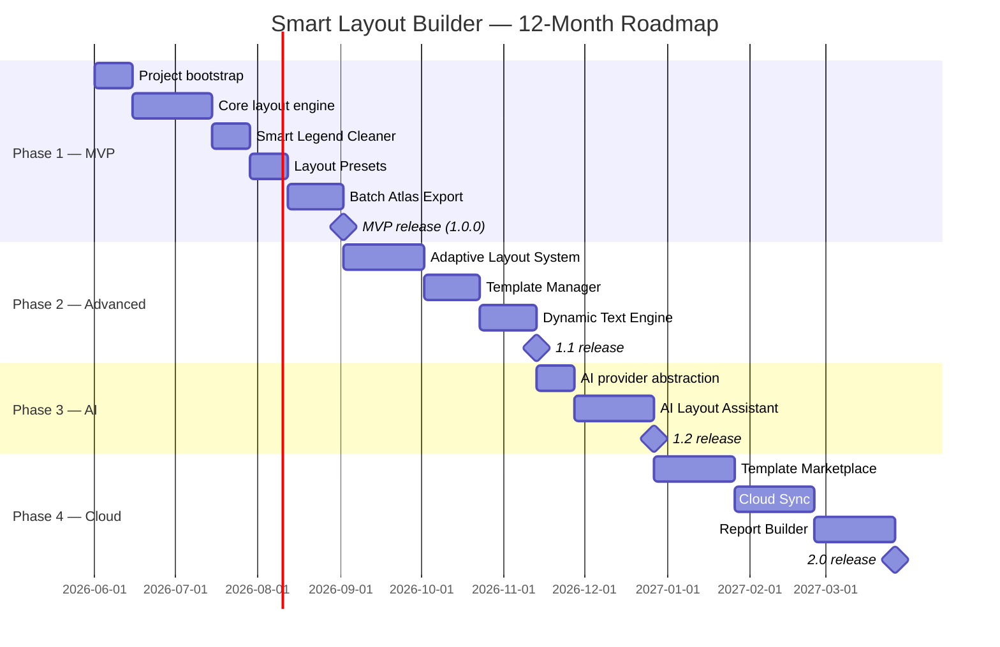

# Smart Layout Builder — Project Plan

> **Status:** Pre-development planning
> **Version:** 0.1.0-draft
> **Author:** Smart Layout Builder Core Team
> **Last updated:** 2026-05-28

---

## 1. Vision

**Smart Layout Builder** transforms the QGIS print-layout experience from a manual, repetitive, click-heavy workflow into an **intelligent, template-driven, AI-assisted cartographic production system**.

Where the native QGIS Layout Designer is a *canvas*, Smart Layout Builder is a **factory**: it understands the project, the data, the audience, and the deliverable, and it produces production-grade maps with one button — at scale, consistently, and with cartographic discipline.

The plugin's north star:

> *"A GIS analyst should be able to go from `.qgz` → publication-ready PDF series for 200 administrative units in under 5 minutes, without opening the Layout Designer once."*

---

## 2. Goals

### 2.1 Strategic Goals

| # | Goal | Measurable Outcome |
|---|------|--------------------|
| G1 | Eliminate repetitive layout work | ≥ 80% reduction in time-to-first-PDF |
| G2 | Standardize cartographic output across teams | Institutional templates enforced via lockable presets |
| G3 | Enable mass atlas production | Export 500 atlas pages in < 10 minutes on commodity hardware |
| G4 | Bring AI into the cartographic workflow | Layout suggestions, legend cleaning, adaptive composition |
| G5 | Modernize QGIS layout UX | Wizard-driven, dock-panel, keyboard-shortcut-first |
| G6 | Be production-grade open-source software | Tested, documented, internationalized, packaged for QGIS Plugin Repo |

### 2.2 Product Goals

- One-click layout generation from any project state.
- Smart legend curation (auto-hide invisible / out-of-extent layers).
- Adaptive layouts that respond to paper size, orientation, and content density.
- First-class **batch atlas export** with parallelism.
- Reusable **organization-wide templates** with versioning.
- A pluggable **AI provider abstraction** (OpenAI / Anthropic / local LLM).
- A **dynamic text expression engine** that goes beyond `[% %]`.

---

## 3. Problems Solved

| Pain Point Today | Smart Layout Builder Solution |
|------------------|-------------------------------|
| QGIS Layout Designer requires manual placement of every map element | **Auto Layout Generator** composes the layout in one call |
| Legends include hidden / out-of-extent layers | **Smart Legend Cleaner** prunes them automatically |
| Atlas export crashes / freezes on large feature sets | **Batch Atlas Exporter** with chunked rendering and progress UI |
| Templates drift across analysts in the same organization | **Locked Organization Templates** with checksum validation |
| Standard map elements (scale bar, north arrow, grid) are reinvented every time | **Layout Presets** ship as first-class objects |
| Layouts break when paper size changes | **Adaptive Layout System** recomputes geometry on resize |
| `[% %]` expressions are limited and not discoverable | **Dynamic Text Engine** with autocompletion, preview, and a token library |
| No way to apply "best practice" cartography heuristics | **AI Layout Assistant** suggests balance, hierarchy, color contrast fixes |
| Reports (multi-page deliverables) require external tools | **Report Export** (composite PDF: cover + atlas + appendix) |

---

## 4. Core Features (MVP)

Detailed breakdown lives in [`features.md`](features.md). Top-line:

1. **Auto Layout Generator** — produce a balanced A3/A4 layout from active project state.
2. **Smart Legend Cleaner** — context-aware legend pruning.
3. **Layout Presets** — save/load named compositions.
4. **Batch Atlas Export** — coverage-layer-driven mass export with progress + cancellation.
5. **Dynamic Text Engine** — token system layered on top of QGIS expressions.
6. **Template Manager** — import/export `.slbtmpl` template archives.
7. **Dock Panel UI** — replaces 90% of trips to Layout Designer.

---

## 5. Future Scope (Post-MVP)

- **AI Layout Assistant** (provider-pluggable: OpenAI, Anthropic, local Ollama).
- **Adaptive Layout Engine** v2: ML-driven element placement.
- **Template Marketplace**: community-shared `.slbtmpl` registry.
- **Cloud Sync**: organization templates synced via Git or S3.
- **Report Builder**: multi-section PDF (executive summary + atlas + data appendix).
- **Live Collaboration**: shared layout sessions over WebSocket.
- **Localization**: ID, EN, ES, FR, ZH at minimum.
- **CLI mode**: `qgis_process slb:atlas-export …` for headless servers.

---

## 6. User Personas

### Persona 1 — *Rina, Regional Disaster Agency Analyst (BPBD)*

- **Context:** Needs 4 hazard maps × 56 sub-districts = 224 PDFs per quarter.
- **Pain:** Each PDF takes 8–12 minutes manually.
- **Win:** Batch atlas export with templated cartouche reduces to one overnight job.

### Persona 2 — *Marcus, Senior Cartographer (Consulting Firm)*

- **Context:** Produces deliverables for multiple clients with distinct brand books.
- **Pain:** Layouts drift; junior analysts can't reproduce the house style.
- **Win:** Locked org templates + dynamic text tokens enforce brand consistency.

### Persona 3 — *Aulia, Urban Planner (Municipal Government)*

- **Context:** Produces ad-hoc maps for council meetings.
- **Pain:** Doesn't use QGIS daily; the Layout Designer is intimidating.
- **Win:** Wizard flow ("What size? What's the title? Pick a preset.") → done.

### Persona 4 — *Dr. Hartono, Researcher*

- **Context:** Writes journal articles with figure-quality maps.
- **Pain:** Needs precise control over legend, scale bar, projection inset.
- **Win:** Presets + the ability to drop down into native Layout Designer for fine-tuning.

### Persona 5 — *Sari, GIS Student*

- **Context:** Learning cartography.
- **Pain:** Doesn't yet know cartographic best practices.
- **Win:** AI suggestions teach by example; presets demonstrate good composition.

---

## 7. Success Metrics

| Category | Metric | Target (12 mo) |
|----------|--------|----------------|
| Adoption | Plugin Repo installs | ≥ 10,000 |
| Adoption | Weekly active users (anonymous telemetry, opt-in) | ≥ 1,500 |
| Productivity | Average time-to-PDF (vs. native Layout) | -75% |
| Quality | Bug reports / 1k users / month | ≤ 5 |
| Community | GitHub stars | ≥ 500 |
| Community | External contributors with merged PRs | ≥ 10 |
| Documentation | Docs coverage (public API) | ≥ 90% |
| Tests | Code coverage | ≥ 80% |

---

## 8. Risks

| Risk | Likelihood | Impact | Mitigation |
|------|------------|--------|------------|
| QGIS API changes between LTRs | High | High | Compatibility matrix in CI; abstraction layer over QGIS API |
| PyQt5 → PyQt6 migration | Medium | High | Adapter module isolating Qt calls |
| AI provider lock-in / cost | Medium | Medium | Provider abstraction; local Ollama fallback |
| Performance regression on huge atlases (>1000 features) | High | High | Chunked rendering; parallel export; benchmarks in CI |
| Template format breaking changes | Medium | High | Versioned schema (`schemaVersion` field); migrations |
| User data loss (overwriting projects) | Low | Critical | All writes go through atomic temp-file → rename; never mutate `.qgz` |
| Cartographic correctness (wrong CRS, distortion) | Medium | High | Pre-export validation; CRS warnings in UI |
| Maintainer burnout (open source) | Medium | High | Modular architecture; clear contribution guide; co-maintainers |

---

## 9. Roadmap (Calendar)

Detailed phase breakdown in [`development-roadmap.md`](development-roadmap.md).

---

## 10. Monetization Possibilities

> The **core plugin remains free and open-source** under the GPL-3.0 (QGIS-compatible). Monetization happens around the edges.

| Stream | Description | Effort | Risk |
|--------|-------------|--------|------|
| **Hosted AI service** | Managed endpoint for AI suggestions; free tier + paid quota | Medium | Medium — must compete with BYOK |
| **Premium template marketplace** | Curated org templates (govt., NGO, corporate brand books) | Low | Low |
| **Enterprise support contracts** | SLA, custom templates, on-site training | High | Low |
| **Sponsorship** | GitHub Sponsors, Open Collective | Low | Low |
| **Consulting services** | Custom integrations for govt. / NGO clients | High | Low |

---

## 11. Open-Source Strategy

- **License:** GPL-3.0 (matches QGIS).
- **Governance:** Benevolent maintainer model initially, transition to steering committee at 5+ active contributors.
- **Contribution funnel:** "Good first issue" labels, mentor-matching, fortnightly triage.
- **Code of Conduct:** Contributor Covenant 2.1.
- **Release cadence:** Time-based (monthly minor, weekly patch when needed).
- **Public roadmap:** GitHub Projects board, mirrored to docs site.
- **Transparency:** Public design docs, RFC process for breaking changes.

---

## 12. Plugin Distribution Strategy

### 12.1 Primary

- **QGIS Plugin Repository** (`plugins.qgis.org`) — official channel, auto-update.

### 12.2 Secondary

- **GitHub Releases** — signed `.zip` per release for offline / corporate installs.
- **PyPI mirror** *(optional)* — for headless server installs via `pip install qgis-smart-layout-builder`.
- **Docker image** — `qgis-server` + plugin preinstalled, for CI atlas pipelines.

### 12.3 Versioning

- **Semantic versioning** strictly: `MAJOR.MINOR.PATCH`.
- **Pre-release** tags: `1.0.0-rc.1`, `1.0.0-beta.3`.
- **Compatibility matrix** published per release (QGIS 3.28 LTR, 3.34 LTR, 3.40 LTR, …).

### 12.4 Release Checklist

1. CI green on all supported QGIS LTRs.
2. CHANGELOG.md updated.
3. metadata.txt version bumped.
4. Translations refreshed (`pylupdate5`).
5. Docs regenerated.
6. Git tag signed.
7. `make package` → `.zip` artifact.
8. Upload to QGIS Plugin Repo + GitHub Release.

---

## 13. Out of Scope (Explicit Non-Goals)

To stay focused, the following are **explicitly NOT in scope** for Smart Layout Builder:

- Replacing the QGIS Layout Designer entirely (we complement, not replace).
- 3D map composition (use Qgis2threejs).
- Web map tile export (use qgis2web).
- Symbology editing (use native QGIS symbology dialogs).
- Data editing or analysis (out of cartographic scope).

---

## 14. Glossary

| Term | Definition |
|------|------------|
| **Atlas** | A QGIS print-layout feature that iterates over a coverage layer to produce one map per feature. |
| **Coverage layer** | The vector layer driving an atlas iteration. |
| **Preset** | A reusable named layout configuration (paper size, elements, expressions). |
| **Template** | A `.slbtmpl` archive containing presets + assets + metadata. |
| **Dynamic token** | A `[%@slb.… %]` expression evaluated at render time. |
| **Adaptive layout** | A layout that recomputes element geometry on resize / data change. |

---

*End of plan.md*
