# Architecture Scorecard — Smart Layout Builder

> **Scale:** 1 (terrible) — 10 (excellent).
> **What's scored:** The planning documents *as written*, before any simplification.
> **What's scored separately:** The same dimensions after applying [`simplification-plan.md`](simplification-plan.md).

---

## 1. Summary Table

| Dimension | Current Plan | After Simplification | Δ |
|-----------|--------------|----------------------|---|
| Scalability | **6** | **7** | +1 |
| Simplicity | **2** | **8** | +6 |
| Maintainability | **3** | **8** | +5 |
| Extensibility | **8** | **6** | −2 |
| Performance | **5** | **6** | +1 |
| UX Practicality | **5** | **8** | +3 |
| MVP Readiness | **2** | **8** | +6 |
| Technical Feasibility | **4** | **8** | +4 |
| **Overall** | **4.4** | **7.4** | **+3.0** |

**Reading.** The plan trades short-term simplicity and shipability for long-term extensibility that's mostly unneeded. The simplified version sacrifices some optionality and scores marginally lower on extensibility — but every other dimension improves significantly, especially **MVP readiness** and **simplicity**.

---

## 2. Dimension-by-Dimension

### 2.1 Scalability — Current: 6 / 10

**What it means here:** Can the codebase grow to handle 10x more users, 10x more features, 10x more data?

**Why 6:**
- ✅ Good separation of concerns *in theory*.
- ✅ Caching strategy is thoughtful.
- ❌ Atlas parallelism is brittle (R-02); won't scale to large coverage without crashing.
- ❌ SQLite + 15 tables × untested migrations will create scaling pain.
- ❌ Architecture complexity itself doesn't scale to volunteers.

**Recommendation:** Treat *contributor scalability* as more important than *user-volume scalability* for an OSS plugin. The plan optimizes the wrong axis.

### After simplification — 7

- ✅ Sequential atlas: known performance characteristics; clear extension path.
- ✅ Flat module structure scales linearly with feature count.
- ⚠ Loses parallelism optionality (re-added carefully later).

---

### 2.2 Simplicity — Current: 2 / 10

**What it means here:** How much cognitive load to read, understand, and modify the codebase?

**Why 2:**
- 5-layer hexagonal architecture for a desktop plugin.
- DI container, Event Bus, Use Cases, Ports, Adapters — each individually fine, collectively brutal.
- 30+ directories planned.
- 6 extension registries.
- Custom file format.
- 4 AI providers.
- A constraint solver.
- 15-table SQLite schema.

**Each addition is justifiable.** The sum is not.

### After simplification — 8

- 6 packages.
- ~12 real code files.
- Direct `qgis.*` imports.
- JSON files for everything storage-related.
- No DI, no event bus, no use cases.

---

### 2.3 Maintainability — Current: 3 / 10

**Why 3:**
- Solo or small-team maintainability is poor. Each feature touches 4–6 directories.
- Schema migration for SQLite alone is a sustaining engineering cost.
- Custom `.slbtmpl` format + migrator + signer is forever maintenance.
- 4 AI provider adapters × API drift = ongoing churn.
- CI matrix of 12 combos drowns small fixes in red builds.
- Localization to 5 languages with string churn ≈ translator fatigue.

**Why not 1:** The documentation itself is genuinely good, which helps. ADR system planned. Coding standards thoughtful.

### After simplification — 8

- No SQLite migrations.
- No custom format.
- No AI providers.
- 1 OS + 1 LTR CI.
- English-only at MVP.
- Quarterly maintenance ≈ hours, not weeks.

---

### 2.4 Extensibility — Current: 8 / 10

**Why 8:** This is what the plan does *best*. Six extension registries (composition, AI, exporters, templates, tokens, panels), a public API with stability tiers, hook points for `before_compose` / `after_export` / etc.

**Why not 10:** Extension surfaces designed without a real consumer almost never fit the first real consumer. Most will be redesigned the first time someone tries to use them.

### After simplification — 6

- All those extension points removed for MVP.
- Means extensibility is **possible** (Python is extensible) but **not designed**.
- The trade-off: lose some optionality, gain shippability.
- After 1.0, design extensions *for* the actual use cases that emerge.

---

### 2.5 Performance — Current: 5 / 10

**Why 5:**
- ✅ Bounded memory, atomic writes, async-friendly design — good principles.
- ❌ Performance budgets set without baseline measurement (e.g., "atlas 56 features in 60s on 4 cores" — what map? what raster?).
- ❌ Live preview targets (24 fps) unrealistic.
- ❌ Parallel atlas with N project clones is a memory pessimization on most projects.
- ❌ Plugin startup ≤ 100ms unrealistic given QGIS Python overhead.

### After simplification — 6

- Sequential atlas: predictable memory.
- Targets stated as relative to native QGIS, not absolute numbers.
- Static preview avoids the fps trap.
- Honest startup measurement, not promise.
- Doesn't score higher because performance work is genuinely deferred — the simplified plan doesn't add benchmarks; it removes false targets.

---

### 2.6 UX Practicality — Current: 5 / 10

**Why 5:**
- ✅ UX principles list (UX1–UX9) is correct and grounded.
- ✅ Dock-based persistent control surface is the right model.
- ❌ Onboarding wizard at MVP is unnecessary friction.
- ❌ AI tab at MVP confuses focus.
- ❌ Live preview promised then deferred undermines UX.
- ❌ 4 tabs in dock = decision fatigue.
- ❌ Settings dialog with 6 tabs = power-user wasteland.

### After simplification — 8

- 2 tabs (Compose + Atlas).
- 1 dialog (Settings, 3 fields).
- No wizard.
- Polish budget reallocated from features to interaction details.
- "Open in Designer" reuses an excellent existing tool, no need for live preview.

---

### 2.7 MVP Readiness — Current: 2 / 10

**Why 2:**
- The plan's MVP includes: F01 + F02 + F04 + F06 + F09 + F12 + F13 + F14 = **8 features in 10 weeks**.
- Each feature is well-defined but the aggregate is too ambitious for a small OSS team.
- Architecture investment (hexagonal + DI + EventBus + ports) eats ~3 weeks before any feature ships.
- 4 default templates, 80% test coverage, EN+ID localization — all good, all too much, too early.

### After simplification — 8

- 3 features (M1/M2/M3).
- 6–8 week timeline.
- 0 architectural pre-work.
- Tracks coverage but doesn't gate.
- English only.

---

### 2.8 Technical Feasibility — Current: 4 / 10

**Why 4:**
- ❌ Parallel atlas as designed: high crash risk (R-02).
- ❌ Custom constraint solver: 2-month rabbit hole on its own (R-05).
- ❌ Multi-provider AI with vision: lifetime maintenance commitment.
- ❌ Marketplace + Cloud Sync: would-be separate projects.
- ❌ Telemetry backend: requires infrastructure the team isn't budgeted for.

**Each subsystem is feasible.** All of them in 12 months is not.

### After simplification — 8

- Sequential atlas: routinely feasible.
- Anchor-based layout: simple, well-understood.
- No AI, no marketplace, no cloud, no telemetry.
- Every feature has known similar implementations in other QGIS plugins.

---

## 3. Score Justification Methodology

For each dimension, the score reflects:

- **2 / 10** — Material design problem; will hurt the project soon.
- **3–4 / 10** — Significant concern; needs intervention before MVP.
- **5–6 / 10** — Acceptable; could improve.
- **7–8 / 10** — Good; small tweaks would improve further.
- **9–10 / 10** — Best-in-class; replicate the pattern elsewhere.

---

## 4. Scorecard — Visual

```mermaid
%%{init: {'theme': 'base'}}%%
xychart-beta
    title "Architecture Scorecard — Current vs Simplified"
    x-axis ["Scalability","Simplicity","Maintainability","Extensibility","Performance","UX","MVP Ready","Feasibility"]
    y-axis "Score (1–10)" 0 --> 10
    bar [6, 2, 3, 8, 5, 5, 2, 4]
    bar [7, 8, 8, 6, 6, 8, 8, 8]
```

The simplified plan trades a single point on **Extensibility** for substantial gains across every other dimension.

---

## 5. Where the Plan Excels (Keep These)

These deserve recognition and should be preserved through any simplification:

1. **The product vision.** Clear, validated, well-articulated.
2. **Persona work.** Grounded in real users.
3. **Cartographic discipline.** Scale-bar/CRS-unit alignment, north-arrow rotation for projected CRSs, audience-driven density.
4. **UX principles list.** UX1–UX9 are correct.
5. **Atlas batch UX design.** Progress + ETA + cancel + resume model is right.
6. **Smart Legend rules.** Genuinely valuable; differentiator.
7. **Risk awareness language.** Even if the risks themselves were partly self-inflicted.
8. **Documentation quality and Mermaid usage.** Reusable artifacts.

---

## 6. Where the Plan Falls Short (Fix These)

1. **Architecture style mismatch.** Enterprise patterns in a plugin.
2. **MVP definition.** Too big.
3. **Roadmap calendar.** Fictional 12-month commitments.
4. **AI subsystem timing.** Way too early.
5. **Custom file format.** Unnecessary.
6. **SQLite + 15 tables.** Unjustified storage.
7. **Performance promises.** Not measured.
8. **Test ambition.** Too much, too soon.

---

## 7. Composite Recommendation

The current planning scores **4.4 / 10 overall** — viable as planning but unhealthy as a build instruction. The simplified plan scores **7.4 / 10** — clearly shippable, maintainable, and honest about its limits.

**The single most valuable change** is *not* picking different technology or different features. It's **cutting scope**. The same team, the same skills, the same product idea — at half the scope — has roughly 4× the probability of success.

---

## 8. Final Score in Context

For comparison, here's how widely-loved QGIS plugins might score (back-of-envelope):

| Plugin | Scalability | Simplicity | Maintainability | Overall |
|--------|-------------|------------|-----------------|---------|
| QuickMapServices | 7 | 8 | 8 | 7.7 |
| DataPlotly | 6 | 8 | 7 | 7.0 |
| qgis2web | 5 | 7 | 7 | 6.3 |
| Profile Tool | 6 | 9 | 8 | 7.7 |
| **SLB (current plan)** | **6** | **2** | **3** | **3.7** |
| **SLB (simplified plan)** | **7** | **8** | **8** | **7.7** |

The simplified plan would put SLB *in the company of its peers*. The current plan would put it in the company of plugins that died on the vine.

---

## 9. One-Number Bottom Line

**4.4 → 7.4.** The simplification recovers 3 full points across 8 dimensions.

That's the difference between a project that ships and one that doesn't.

---

*End of architecture-scorecard.md*
