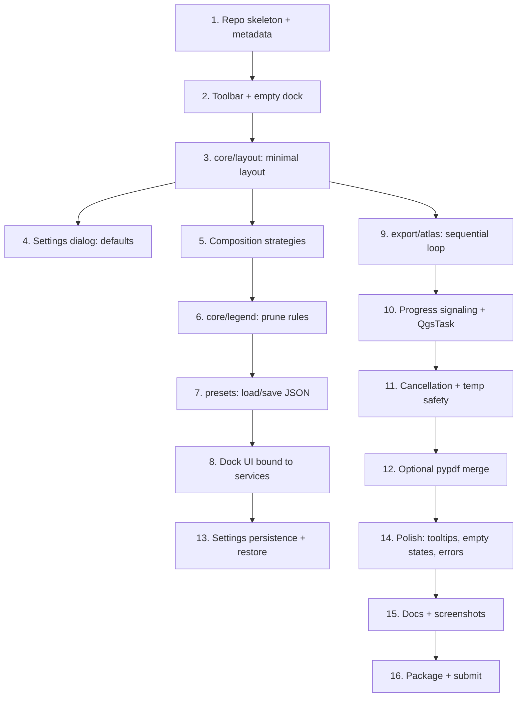

# Implementation Order — Smart Layout Builder

> **Companion to:** [`revised-roadmap.md`](revised-roadmap.md), [`mvp-recommendation.md`](mvp-recommendation.md), [`simplification-plan.md`](simplification-plan.md).
> **Purpose:** Tell a developer **exactly** what to build first, second, third — and why.

---

## 1. Mental Model — Dependency Order

Two parallelizable tracks emerge once `core/layout` exists:
- **Track A:** Layout → Strategies → Legend → Presets → Dock.
- **Track B:** Layout → Atlas → Progress → Cancel → Merge.

If two people work, they can split at step 3. If one person, follow the linear order.

---

## 2. Build Sequence — Detailed

For each step: **what**, **why first**, **DoD** (definition of done), and **trap** to avoid.

### Step 1 — Repo Skeleton + Metadata

**What:**
- `slb/__init__.py` (3 lines: `def classFactory(iface): from .plugin import SmartLayoutBuilder; return SmartLayoutBuilder(iface)`).
- `slb/metadata.txt` minimal (name, version, qgisMinimumVersion).
- `slb/plugin.py` shell class with `initGui()` / `unload()`.
- `pyproject.toml` for ruff/black/mypy.
- `.gitignore`.
- GitHub Actions: lint + import-check on Linux.

**Why first:** Cannot test anything until the plugin loads in QGIS. Establishing this loop is the foundation.

**DoD:** Plugin appears in QGIS Plugin Manager and can be enabled/disabled cleanly.

**Trap:** Importing `qgis.PyQt.QtWidgets` at module top-level during `__init__.py` of the package. Slows plugin discovery. Keep top-level imports minimal.

---

### Step 2 — Toolbar + Empty Dock

**What:**
- 1 toolbar action ("Smart Layout Builder").
- 1 `QDockWidget` with placeholder text.
- Wire the action to toggle dock visibility.

**Why before logic:** Confirms UI registration and cleanup paths work. Many plugins fail here on `unload()` (signal leaks, dangling actions). Catching this early prevents 100 future bugs.

**DoD:** Plugin Reloader can reload the plugin 5× without crashing QGIS or duplicating the toolbar icon.

**Trap:** Forgetting `iface.removeDockWidget(dock)` in `unload()`. Dock becomes orphaned.

---

### Step 3 — `core/layout.generate_layout()` Minimal

**What:**
- Function signature: `def generate_layout(project: QgsProject, paper_size: str, orientation: str) -> QgsPrintLayout`.
- Body: creates a `QgsPrintLayout`, adds a map item filling 80% of page, sets extent to canvas extent, adds to project.
- One call site: a temporary debug button in the dock.

**Why first (after plumbing):** This proves the core value-prop technically works in ~50 lines. From here, everything is incremental.

**DoD:** Click button → new layout appears in QGIS Layouts list with the project's current extent.

**Trap:** Trying to handle "no layers" or "no project loaded" elegantly here. Just assert preconditions; polish later.

---

### Step 4 — Settings Dialog with Defaults

**What:**
- `QDialog` with: default paper (`A4`/`A3`), default output folder (`QLineEdit` + `QFileDialog`).
- Persists via `QSettings("SLB","SLB")`.
- Menu entry: `Plugins → Smart Layout Builder → Settings`.

**Why now, not later:** You'll want defaults to test atlas later (output folder). Doing it once now saves repeated coding.

**DoD:** Open dialog, change paper, restart QGIS, reopen dialog — paper is remembered.

**Trap:** Building a tabbed settings dialog. **Stay flat** — just 3 fields total at this stage.

---

### Step 5 — Composition Strategies

**What:**
- `core/strategies.py` with two functions:
  - `two_column(paper_w, paper_h) -> list[ItemSpec]`
  - `single_column(paper_w, paper_h) -> list[ItemSpec]`
- `ItemSpec = TypedDict({"role": str, "x_mm": float, ...})` or plain `dict`.
- `generate_layout` picks based on orientation.

**Why before legend / presets:** You need to know "what items get placed" before you know "which layers populate the legend".

**DoD:** Landscape generates a two-column layout with map left + sidebar right; portrait gives a top-down stack.

**Trap:** Building a "strategy framework" with ABCs + registries. **Two functions is fine.** Strategy pattern becomes useful at 5+ strategies; not at 2.

---

### Step 6 — Smart Legend Pruning

**What:**
- `core/legend.prune_legend(layout: QgsPrintLayout, project: QgsProject, mode: str) -> int`
- `mode = "safe"` (default): drop `LegendExcluded` + invisible.
- `mode = "extent"` (opt-in): also drop layers with zero features in extent. Timeout per layer.
- Returns count of pruned items.

**Why now:** Now that layouts have a legend, you can meaningfully prune it.

**DoD:** Hidden layer + one out-of-extent layer → both removed from generated legend (in `extent` mode).

**Trap:** Trying to be smart about category-level pruning (raster classes, vector sub-symbology). Skip for MVP.

---

### Step 7 — Presets (JSON, no DB)

**What:**
- `presets/repository.py`:
  - `list_presets() -> list[PresetMeta]`
  - `load_preset(name) -> dict`
  - `save_preset(name, data) -> None`
  - `delete_preset(name) -> None`
- Storage: `~/.qgis/SLB/presets/<name>.json`.
- `resources/builtin_presets/`: 2 starter JSONs that ship in the plugin folder and are copied to user dir on first run.

**Why now:** Layout works. Strategies work. Legend works. Now: name a configuration, retrieve it later.

**DoD:** Save a preset; close QGIS; reopen; preset still there; load it; generate; same output.

**Trap:** Adding version history, locking, signing, tags. **No.** Just JSON files.

---

### Step 8 — Dock UI Wired to Services

**What:**
- Compose tab in dock:
  - Preset dropdown (with reload button).
  - Paper combo + orientation radio.
  - Save / Save As / Delete preset buttons.
  - "Generate Layout" primary button.
  - "Open in Layout Designer" secondary button.

**Why now:** All backend functions exist. Wiring UI to them is mechanical.

**DoD:** Whole flow works from the dock: pick preset → generate → open in Designer.

**Trap:** Live preview thumbnail. Defer — adds 2 days of UX testing for marginal value.

---

### Step 9 — Sequential Atlas Export

**What:**
- `export/atlas.py`:
  - `def run_atlas(project, layout, coverage_layer, filter_expr, out_dir, filename_template, on_progress, cancel_flag) -> AtlasResult`
- Iterates features (respecting filter), sets atlas feature on layout, exports to PDF per feature.
- Filename: simple `[%fieldname%]` substitution + sanitization.

**Why now:** Layout works; atlas is "apply layout per feature".

**DoD:** Run atlas on a 5-feature fixture → 5 PDFs in `out_dir`, named correctly.

**Trap:** Trying parallel from day one. **Sequential. Sequential. Sequential.** Parallel is post-1.0.

---

### Step 10 — Progress Signaling via `QgsTask`

**What:**
- Wrap `run_atlas` in a `QgsTask` subclass.
- Emit progress (0–100) per feature.
- Status string ("Rendering Banjar_Selatan…").
- ETA from rolling average.

**Why after step 9:** Get sequential correctness first, then wrap for UX.

**DoD:** Atlas tab shows progress bar updating live; ETA approximately accurate.

**Trap:** Using `threading.Thread` instead of `QgsTask`. Cross-thread Qt signal connections become a foot-gun. Use the QGIS-native mechanism.

---

### Step 11 — Cancellation + Temp File Safety

**What:**
- `cancel_flag` checked between features.
- Each PDF written to `out_dir/.tmp/<name>.pdf` then `os.replace()`'d to `out_dir/<name>.pdf` on success.
- On cancel: delete `.tmp/`.
- On crash: `.tmp/` persists; user can rerun (idempotency: skip files that already exist if user opts).

**Why now:** Long jobs without cancel are unusable. Atomic writes prevent corrupted outputs.

**DoD:** Cancel at feature 25/100 → 24 complete files in `out_dir`, no half-written PDFs.

**Trap:** Cancellation timing. Check after each feature, not mid-render (which isn't safely interruptible).

---

### Step 12 — Optional PDF Merge

**What:**
- Detect `pypdf` (or `PyPDF2`) import at module load.
- If available: optional checkbox "Merge to single PDF".
- If not: hide checkbox + show one-line note in Settings dialog.

**Why optional:** Hard runtime dependencies kill plugin installs on locked-down corporate systems.

**DoD:** On a fresh QGIS where `pypdf` isn't installed, plugin still works; checkbox is hidden.

**Trap:** Vendoring `pypdf`. It's 100+ files; license issues; updates. Keep it optional.

---

### Step 13 — Settings Persistence + Window State

**What:**
- Dock state (open/closed, geometry) saved on `closeEvent`.
- Last-used preset, paper, output folder, filename template saved per call.
- Restored on next QGIS start.

**Why now:** UX glue. The plugin should "remember" you across sessions.

**DoD:** Close QGIS mid-work; reopen; SLB dock is in the same place with last preset selected.

**Trap:** Storing this in JSON when `QSettings` exists. Use `QSettings`.

---

### Step 14 — Polish

**What:**
- Tooltips on every button (`tr()` wrapped).
- Empty states (no project loaded? no layers? friendly text).
- Error dialogs with **action** ("Open settings", "Choose folder").
- Validation: filename collision pre-check; folder writability pre-check.
- Help link on each tab → README anchor.

**Why now:** Polish is what separates "alpha" from "beta".

**DoD:** A user who has never seen SLB before can produce one atlas without asking for help.

**Trap:** Skipping this to ship sooner. The polish is the product.

---

### Step 15 — Documentation

**What:**
- `README.md`: install, screenshots, quick start, known limits, contributing.
- `USAGE.md`: detailed walkthrough of each feature.
- 4–6 screenshots: dock compose, dock atlas, generated layout, settings, error.
- `CHANGELOG.md` with 1.0.0-beta1 entry.

**Why before submit:** Plugin Repo requires it; users require it; you'll forget how things work in 3 months.

**DoD:** Someone external can install + use the plugin from the README alone.

**Trap:** Auto-generated API docs. No public API yet; no docs needed.

---

### Step 16 — Package + Submit

**What:**
- `scripts/package.py` produces a clean `.zip` from `slb/`.
- Strip `__pycache__`, `*.pyc`, `tests/`, `docs/`.
- Test install in clean QGIS profile.
- Submit to Plugin Repo as `experimental=True`.

**Why last:** Don't submit until everything else works.

**DoD:** Plugin appears in Plugin Repo; install via Plugin Manager → "Install Experimental" works.

**Trap:** Hardcoded paths. Test on a profile that's not your dev profile.

---

## 3. Anti-Patterns — Build These NEVER (or Much Later)

### 🚫 Never build before MVP

| Item | Why never (yet) | When (if ever) |
|------|-----------------|----------------|
| `BaseExporter` ABC + registry | One exporter today; YAGNI. | When adding 3rd format. |
| `IAIProvider` Protocol | No AI yet. | When AI ships, in a single file. |
| EventBus / pub-sub | Direct signals suffice. | When > 5 cross-package signal pairs. |
| DI container | Plain attrs suffice. | Probably never. |
| Constraint solver | Anchors suffice. | Only if anchors visibly fail users. |
| SQLite + migrations | JSON files suffice. | When you need queries / analytics. |
| `.slbtmpl` format | JSON files suffice. | When orgs need bundling. |
| Marketplace / Cloud Sync | Vapor. | After 5,000 installs. |
| Telemetry backend | Free Plugin Repo stats. | Never, probably. |
| Live preview | "Open in Designer" suffices. | When users specifically ask. |
| PyQt6 abstraction | `qgis.PyQt` already abstracts. | Never. |

### 🚫 Never build too early

| Item | Earliest correct phase |
|------|------------------------|
| Multi-strategy framework | When you have 3+ strategies. |
| Plugin extension API | When 1 external plugin exists asking for it. |
| Public API stability guarantees | After 1.0 has been in the wild 6 months. |
| Localization to N languages | When N translators volunteer. |
| Snapshot/golden-PDF testing | When PDFs are stable enough to be golden. |
| Mutation testing | When test suite is mature (>200 tests, all green). |

---

## 4. What to Do When Tempted to Skip Ahead

A common failure mode: "While I'm in `legend.py`, let me just add AI grouping while I'm here…"

**Resist.** Capture the idea in `BACKLOG.md`. Move on. The whole project succeeds when discipline > inspiration.

---

## 5. Estimated Time Per Step

For a developer working 4 hours/day on this:

| Step | Effort | Cumulative |
|------|--------|------------|
| 1 | 0.5 day | 0.5 |
| 2 | 0.5 day | 1.0 |
| 3 | 1 day | 2.0 |
| 4 | 0.5 day | 2.5 |
| 5 | 1 day | 3.5 |
| 6 | 1 day | 4.5 |
| 7 | 1 day | 5.5 |
| 8 | 1.5 days | 7.0 |
| 9 | 1.5 days | 8.5 |
| 10 | 1 day | 9.5 |
| 11 | 1 day | 10.5 |
| 12 | 0.5 day | 11.0 |
| 13 | 0.5 day | 11.5 |
| 14 | 1.5 days | 13.0 |
| 15 | 1 day | 14.0 |
| 16 | 0.5 day | 14.5 |

**≈ 15 working days of focused work, or ~6 weeks at 4 hrs/day.**

Add 20% buffer for unforeseen QGIS API surprises = ~7 weeks.

---

## 6. Quality Gates (Per Step)

Each step is "done" only when:

- [ ] Code merges to `main` (no long-lived branches at MVP scale).
- [ ] At least one unit test or integration test added.
- [ ] CI green.
- [ ] Plugin still loads & unloads cleanly in QGIS.
- [ ] Step listed in CHANGELOG under `## Unreleased`.

If any item fails, the step is **not done**, regardless of what the calendar says.

---

## 7. Sequencing Wisdom

Three principles that govern the order:

1. **Plumbing before pretty.** Loading/unloading the plugin cleanly is more important than what's inside the dock.
2. **Backend before UI.** Get `generate_layout()` working with no UI, then wire UI. The reverse leads to mock-driven design that doesn't match reality.
3. **One feature, end-to-end, before the next.** Resist "let me build the model layer for all features first, then UI for all features." It's the path to a half-finished plugin.

---

## 8. Stop-the-Line Rules

If during any step you discover:

- A QGIS API doesn't behave as expected → **stop, spike, document.**
- The current design forces you to refactor a previous step → **stop, refactor, retest.** Compounding hacks kill plugins.
- You need to add a dependency → **stop, evaluate.** Is it optional? Is it required? Is the cost worth it?

Don't power through. The right answer is often: shrink scope, not push harder.

---

## 9. After MVP — What's Next First?

Once 1.0-beta is in users' hands, the implementation order of 1.1 is **dictated by feedback**, but likely:

1. Whichever atlas-export bug got most thumbs-up.
2. Inset map item (anticipated demand).
3. Indonesian localization (if a translator appears).
4. Export history pane (file-based, not DB).

Do not start building 1.1 features until 1.0 stable ships.

---

*End of implementation-order.md*
