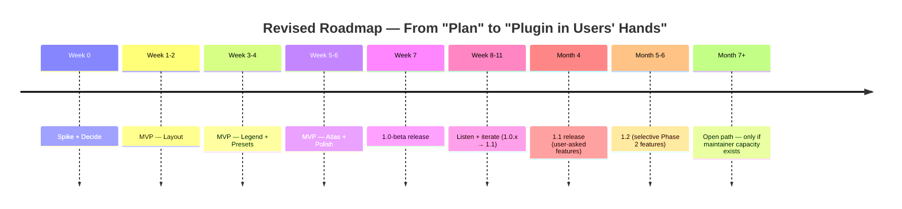

# Revised Roadmap — Smart Layout Builder

> **Replaces:** `docs/development-roadmap.md` (the 12-month plan).
> **Philosophy:** Ship something narrow and good in 6–8 weeks. Earn the right to be ambitious.

---

## 1. The New Shape

**No commitments past Month 6.** The roadmap beyond is intentionally open — driven by real user feedback, not speculation.

---

## 2. Phase 0 — Validation Spike (Week 0, ~3 days)

### Goal
Before writing production code, **prove the riskiest assumptions are valid**.

### Spikes (each timeboxed to 1 day)

| Spike | Question | Pass Criteria |
|-------|----------|---------------|
| **S0.1** | Can a Python plugin produce a balanced `QgsPrintLayout` programmatically in < 200 LOC? | Yes → green-light layout engine direction. |
| **S0.2** | Can we count features in extent across vector + raster + WFS layers in < 50ms per layer? | Mostly yes → opt-in extent pruning is safe. |
| **S0.3** | Can sequential atlas export a 5-feature `.qgz` to 5 PDFs in < 30s? | Yes → MVP atlas approach viable. |

### Spike outputs
- 3 throwaway branches with proof-of-concept code.
- 1-page `spikes.md` documenting findings.
- Go / no-go on each.

### Why this matters
Skipping spikes is the #1 way OSS plugin projects discover, at month 3, that their core approach doesn't work.

---

## 3. Phase 1 — MVP (Weeks 1–6, target 1.0.0-beta)

### Theme
**Minimal viable cartographer's assistant.** Auto Layout + Smart Legend + Sequential Atlas. Ship it.

### Week-by-Week

#### Week 1 — Plumbing + first layout

| Day | Deliverable |
|-----|-------------|
| Mon | Repo bootstrap: `slb/`, `metadata.txt`, `__init__.py`, `plugin.py`, CI (lint+test on Linux only). |
| Tue | Toolbar action + empty `SLBDock`. Confirm plugin loads/unloads cleanly via Plugin Reloader. |
| Wed | `core/layout.generate_layout()` — produces a `QgsPrintLayout` with map + title item. |
| Thu | Add legend + scale bar + north arrow + attribution items. |
| Fri | Wire dock "Generate Layout" button → service → opens layout in Designer. |

**End of week 1:** Working "click → layout" demo. Show to a real GIS user; collect 3 reactions.

#### Week 2 — Composition strategy + Smart Legend v1

| Day | Deliverable |
|-----|-------------|
| Mon | Anchor-based composition: two-column (landscape) + single-column (portrait). |
| Tue | Paper + orientation selector in dock. Generation respects both. |
| Wed | `core/legend.prune_legend()` — hide invisible + LegendExcluded layers. |
| Thu | Idempotency tests for legend cleaner. |
| Fri | Bug fixes; first integration test (real `.qgz` fixture). |

#### Week 3 — Presets

| Day | Deliverable |
|-----|-------------|
| Mon | `presets/repository.py` — load/save JSON files in `~/.qgis/SLB/presets/`. |
| Tue | 2 default presets shipped in `resources/builtin_presets/` (Classic A4, Editorial A3). |
| Wed | Dock preset dropdown + Save/Save As/Delete. |
| Thu | Settings dialog (paper default + output folder default). |
| Fri | Spike: optional `pypdf` import + degradation when missing. |

#### Week 4 — Atlas v1

| Day | Deliverable |
|-----|-------------|
| Mon | `export/atlas.run_atlas()` — sequential loop over coverage features. |
| Tue | Filename template parsing + collision detection. |
| Wed | Atlas tab in dock (coverage selector, filter, output folder, filename, start button). |
| Thu | Progress signal + `QgsTask` integration. |
| Fri | Cancel works; atomic temp writes. |

#### Week 5 — Atlas v2 + PDF merge

| Day | Deliverable |
|-----|-------------|
| Mon | Optional merge-to-single-PDF using `pypdf`. |
| Tue | Estimate ETA from rolling average of per-feature time. |
| Wed | Error handling: write atomic temp; surface per-feature failures without aborting whole job. |
| Thu | Cancellation cleanup (temp files removed). |
| Fri | First real-world atlas test: 56-feature fixture, measure end-to-end. |

#### Week 6 — Polish + Plugin Repo submission

| Day | Deliverable |
|-----|-------------|
| Mon | README + USAGE.md + screenshots. |
| Tue | Icon set finalized (4 SVGs). |
| Wed | Final pass on tooltips, error messages, empty states. |
| Thu | Package + sign + dry-run install in clean QGIS profile. |
| Fri | Submit to QGIS Plugin Repo as **experimental** (1.0.0-beta1). |

### Week 7 — Beta release

| Action | Detail |
|--------|--------|
| Plugin Repo experimental release | Tag `v1.0.0-beta1`. |
| Announce on QGIS forum | Single post, honest about scope. |
| Announce on r/QGIS + GIS Stack Exchange | Same content, different audience. |
| Open `#discussions` for feedback | Use GitHub Discussions, not issues, for early feedback. |
| Personal outreach | Email 5 known GIS analysts; ask for 30-min feedback call. |

### Exit Criteria for MVP

- [ ] All 11 acceptance criteria in [`mvp-recommendation.md`](mvp-recommendation.md) §7 pass.
- [ ] Plugin Repo submission accepted.
- [ ] At least 3 unsolicited external users have tried it.
- [ ] No CRITICAL bugs open (HIGH bugs may be open with workaround docs).

---

## 4. Phase 2 — Listen & Iterate (Weeks 7–11, target 1.0.x → 1.1)

### Theme
**Don't build. Listen.**

### Week 7–8: triage & bug-fix

- Hold a weekly office hour (1h slot).
- Categorize incoming issues:
  - **bug-1.0** — fix in patch release.
  - **wishlist-1.1** — backlog for next minor.
  - **future** — defer.
- Cut `1.0.0-rc1`, then `1.0.0` (drop experimental flag) at week 9 if stable.

### Week 9–11: 1.1 features driven by feedback

Build only what users actually asked for. Likely candidates (from anticipated feedback):

- **Inset map item** (frequently requested for atlas).
- **Export grid + grid labels** as items.
- **Atlas resume after crash.**
- **Indonesian translation** (if users ask).
- **PNG output for atlas.**
- **History panel** (file-based JSONL).
- **"Open in Designer after generate" toggle.**

**Don't pre-commit.** Use issue thumbs-up / reactions to rank.

### 1.1 Release

End of week 11. Real users have asked for these; we deliver these. Tag `v1.1.0`.

---

## 5. Phase 3 — Selective Phase 2 Features (Months 4–6, target 1.2)

By month 4, the maintainer has data on:
- Who the users are.
- What they actually use.
- Where the bottlenecks are.

Pick **two** features from the original "Phase 2" list:

| Candidate | Worth Doing If… |
|-----------|-----------------|
| Anchor-based adaptive layout | Users report broken layouts on paper-size change. |
| Live debounced preview | Users find round-tripping to Designer slow. |
| Dynamic text tokens (small set) | Users need data they can't get from `[% %]`. |
| Atlas parallel (experimental flag) | Users hit time limits on big atlases. |

Build the **two highest-signal** features. Tag `v1.2.0` at end of month 6.

### Important: do not build all four

If everything's a priority, nothing is. Pick two. The others wait.

---

## 6. Phase 4 — Open Path (Month 7+)

Beyond month 6, the roadmap is **open**. Possible directions, decided based on capacity + signal:

| Direction | Worth Pursuing If… | Don't Pursue If… |
|-----------|--------------------|------------------|
| AI Layout Assistant | Multiple users request it with concrete use cases. | "It would be cool." |
| Report Builder | Users repeatedly hack around composing multi-section PDFs. | One user mentions it once. |
| Template package format | Org users want to distribute layouts internally. | Solo users would tolerate JSON files. |
| Processing provider / CLI | Users want headless atlas in CI. | Nobody asks. |
| Translations to 3+ languages | Active translators show up. | No translator volunteers. |

**If maintainer capacity is < 4 hours/week**, do **none of these**. Maintain 1.x and prune backlog.

---

## 7. What's Explicitly NOT on the Roadmap

The following are **removed** from the project's roadmap until otherwise decided:

- Template marketplace + index server.
- Cloud sync (Git / S3 / WebDAV).
- Multi-user features.
- Telemetry backend.
- Ed25519 signing infrastructure.
- Reproducible build verification.
- Vision/screenshot AI upload.
- "Live collaboration" / WebSocket sessions.
- "AR map preview" / "Print-shop integration".

These can re-enter the roadmap if and only if:
- A documented user request exists.
- A maintainer has capacity.
- A simpler alternative has been ruled out.

---

## 8. Milestones — Calendar View

| Week | Event | Date* | Tag |
|------|-------|-------|-----|
| 0 | Spikes | Week 1 of dev | — |
| 6 | MVP complete; Plugin Repo submitted | Week 7 | `v1.0.0-beta1` |
| 9 | First stable release | Week 10 | `v1.0.0` |
| 11 | First user-driven minor | Week 12 | `v1.1.0` |
| 24 | Second user-driven minor | Month 6 | `v1.2.0` |
| 36 | Re-evaluate roadmap | Month 9 | — |

*relative to project kickoff; not anchored to absolute calendar dates.

---

## 9. Testing & QA Milestones Per Phase

| Phase | Testing Focus |
|-------|---------------|
| 0 | Spike correctness only |
| 1 (MVP) | Unit tests for core; one integration test per feature; smoke test on Linux + latest LTR |
| 2 (Listen/iterate) | Regression tests for each fixed bug |
| 3 (1.2) | Add Windows + macOS CI; add a second QGIS LTR |
| 4+ | PyQt6 CI; performance benchmarks for atlas |

**Coverage is tracked, not gated** until 1.2. Then introduce a 60% floor.

---

## 10. Cadence Discipline

- **Weekly:** Bug triage (1h).
- **Monthly:** Release a patch or minor; never both in the same week.
- **Quarterly:** Review the roadmap against actual user signal; cut what's stale.

---

## 11. Honest Capacity Estimates

| Team Shape | Realistic Cadence to MVP |
|------------|---------------------------|
| 1 maintainer, 5 hrs/week | 14–18 weeks |
| 1 maintainer, 15 hrs/week | 7–9 weeks |
| 1 maintainer, 30 hrs/week | 5–6 weeks |
| 2 maintainers, 10 hrs/week each | 6–8 weeks |
| 2 maintainers, 20 hrs/week each | 4–5 weeks |

**Pick yours and plan accordingly.** The "6–8 weeks" target above assumes ~20 hrs/week for one person or two people sharing the load.

---

## 12. Comparison with Original Roadmap

| Aspect | Original Plan | Revised |
|--------|---------------|---------|
| First release | Week 13 (1.0.0 with 8 features) | Week 7 (1.0.0-beta with 3 features) |
| Time to first user feedback | ≥ Week 13 | Week 7 |
| Phases planned in advance | 4 phases over 12 months | 2 phases (MVP + Listen), open after |
| Features promised in 12 months | F01–F14 + AI + Marketplace + Cloud | M1–M3 + whatever users ask |
| Release count in 12 months | 5 (1.0, 1.1, 1.2, 1.3, 1.4, 2.0) | 2–3 (1.0, 1.1, possibly 1.2) |
| Burnout probability | High | Manageable |

**Less commitment, more shipping, more responsiveness to reality.**

---

## 13. The Ship-First Principle

The biggest mistake QGIS plugin projects make is **publishing a roadmap before they have a plugin**. A roadmap is a marketing artifact for a project that exists. Before then, it's a procrastination tool.

The right sequence:

1. Spike.
2. Build the smallest thing that solves the problem.
3. Ship it (even as beta).
4. Listen.
5. *Then* roadmap, lightly, for the next 3 months.
6. Repeat.

Anything else is theater.

---

*End of revised-roadmap.md*
