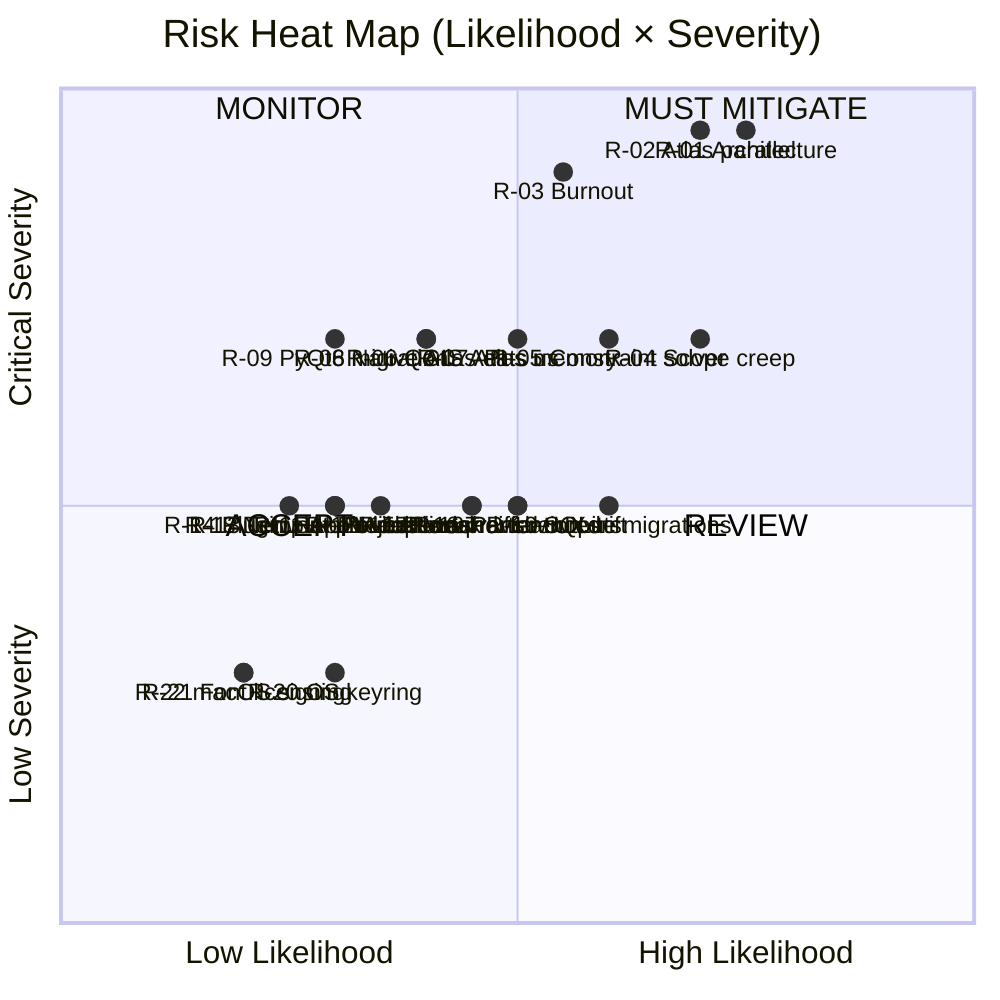

# Risk Analysis — Smart Layout Builder

> **Scope:** Technical, product, UX, maintenance, adoption, performance, compatibility risks for the proposed plugin.
> **Severity:** 🟥 Critical · 🟧 High · 🟨 Medium · 🟩 Low.
> **Likelihood:** % crude estimate.

---

## 1. Risk Register (Sorted by Severity × Likelihood)

| ID | Risk | Severity | Likelihood | Score |
|----|------|----------|------------|-------|
| R-01 | Architecture overengineering causes pre-MVP collapse | 🟥 | 75% | 7.5 |
| R-02 | Parallel atlas export crashes / corrupts output | 🟥 | 70% | 7.0 |
| R-03 | Maintainer burnout before 1.0 | 🟥 | 55% | 5.5 |
| R-04 | Scope creep (AI / marketplace) consumes MVP timeline | 🟧 | 70% | 5.6 |
| R-05 | Custom constraint solver becomes a black hole | 🟧 | 60% | 4.8 |
| R-06 | QGIS LTR API changes break plugin | 🟧 | 40% | 3.2 |
| R-07 | Atlas memory blow-up on raster-heavy projects | 🟧 | 50% | 4.0 |
| R-08 | Native QGIS Atlas improves and erodes our differentiation | 🟧 | 40% | 3.2 |
| R-09 | PyQt5 → PyQt6 migration breaks UI | 🟧 | 30% | 2.4 |
| R-10 | SQLite migration framework introduces bugs | 🟨 | 60% | 3.6 |
| R-11 | AI features leak PII / violate org policy | 🟨 | 30% | 1.8 |
| R-12 | Adoption fails — plugin sits at 50 installs/month | 🟨 | 35% | 2.1 |
| R-13 | Template format change breaks user content | 🟨 | 30% | 1.8 |
| R-14 | Plugin Repo review rejects submission | 🟨 | 25% | 1.5 |
| R-15 | Cross-platform render differences (fonts, AA) | 🟨 | 45% | 2.7 |
| R-16 | Translation drift across releases | 🟨 | 50% | 3.0 |
| R-17 | Live preview rendering pipeline degrades UX | 🟨 | 45% | 2.7 |
| R-18 | Network providers (WFS, PostGIS) crash atlas | 🟨 | 30% | 1.8 |
| R-19 | Cancellation leaves partial outputs on disk | 🟨 | 50% | 3.0 |
| R-20 | OS keyring availability varies | 🟩 | 30% | 1.2 |
| R-21 | Licensing of bundled fonts / icons | 🟩 | 20% | 0.8 |
| R-22 | macOS bundle code-signing requirements | 🟩 | 20% | 0.8 |

Score = severity_weight × likelihood (weights: Critical=10, High=8, Medium=6, Low=4).

---

## 2. Critical Risks — Detail

### R-01 — Architecture overengineering causes pre-MVP collapse 🟥

**Description.** The proposed hexagonal architecture with 5 layers, DI container, event bus, port abstractions, and 14 packages is disproportionate to a QGIS plugin's complexity. Teams that adopt this on a small project typically spend the first 2–4 weeks building the architecture, the next 2 weeks fighting it, and the final 4 weeks abandoning parts of it. Net: ship slips by 50–100%, contributors don't onboard, project loses momentum.

**Indicators.**
- > 30% of week-1 commits are scaffolding / framework.
- New features require 3+ file touches that aren't behavioral.
- "What layer does this belong to?" is asked in PR reviews.

**Mitigation.**
- **Adopt the flat structure in `simplification-plan.md` from day 1.** Do not start with hexagonal and refactor later — refactor never happens.
- Treat the original `architecture.md` as **aspirational reference**, not blueprint.
- Time-box architectural debates: 30 minutes max; ship the simpler option and revisit if it bites.
- New contributors should be productive within their first day.

**Owner.** Project lead. Block on PR if scope creeps.

---

### R-02 — Parallel atlas export crashes / corrupts output 🟥

**Description.** The plan describes N parallel `QgsTask` workers, each opening a copy of `QgsProject`, each rendering a chunk of features, then merging PDFs. This pattern hits multiple QGIS-internal sharp edges:
- `QgsProject` isn't designed for cheap cloning.
- Many `QgsVectorDataProvider`s (PostGIS, WFS) aren't reentrant.
- Symbology cache and label engine contention.
- Cross-thread rendering correctness on some platforms (Windows GDI, macOS QuickDraw paths).

The result is intermittent crashes that look fine in dev and corrupt user output in the field.

**Mitigation.**
- **Make MVP atlas sequential.** This alone is faster than native (because of better UX), without risking correctness.
- **Spike parallel atlas in a branch** post-MVP. Stress-test on:
  - 1000 features × vector-only × indexed GPKG.
  - 200 features × raster basemap.
  - 200 features × PostGIS coverage.
  - 200 features × WFS coverage.
- Only ship parallel atlas behind an experimental flag, **capped at 2 workers**, with a fallback button that says "Atlas crashed last time, try again sequentially?"
- Output writes are atomic (temp file + rename). Cancellation cleans up.

**Owner.** Whoever owns export. Don't promise parallelism in 1.0 release notes.

---

### R-03 — Maintainer burnout before 1.0 🟥

**Description.** OSS plugin maintainer burnout is the most common failure mode for QGIS plugins. The scoped plan demands sustained effort over 12 months, including AI provider work, marketplace, cloud sync, telemetry — categories of work that grind down volunteers. Half of QGIS plugins are abandoned within 24 months of first release ([Plugin Repo data]).

**Indicators.**
- PR review latency > 14 days.
- Issue inbox growing faster than it's drained.
- Maintainer stops responding for > 30 days.

**Mitigation.**
- **Cut scope.** A maintainer working on a 4,000-LOC plugin lasts 3× as long as one working on 15,000.
- **Recruit a co-maintainer before 1.0.** Even one part-time co-maintainer halves burnout risk.
- **Set a triage cadence** (weekly office hour) and stick to it; everything else can wait.
- **Say no in public.** Add a `wontfix` policy in CONTRIBUTING.md. Saying yes to every feature kills the project.
- **Take quarterly breaks** announced in advance.

**Owner.** Project lead's own psychology. This is the most undervalued risk.

---

## 3. High Risks — Detail

### R-04 — Scope creep (AI / marketplace) consumes MVP timeline 🟧

**Description.** AI features are exciting and demoable. They're also a 3–6 month rabbit hole that distorts the project's core. Once "wouldn't AI be cool here?" enters every design conversation, focus is gone.

**Mitigation.**
- **Explicit `wontfix-until-1.0` label** on AI-related issues.
- Public roadmap with AI marked "Phase 3 — pending validation of core".
- Maintainer policy: don't merge AI experiments into `main` until 1.0 ships.

---

### R-05 — Custom constraint solver becomes a black hole 🟧

**Description.** Constraint solvers are the kind of code that takes 2 weeks to write naively, 4 weeks to fix the obvious bugs, and 6 months to handle every edge case real users encounter.

**Mitigation.**
- **Don't build it.** Use anchors (see [`simplification-plan.md`](simplification-plan.md) §2.5).
- If someone insists, time-box the spike to 1 week. If not solid by then, abandon and revisit in 2.0.

---

### R-06 — QGIS LTR API changes break plugin 🟧

**Description.** Even across LTRs, QGIS occasionally renames or removes APIs (`QgsMapLayerRegistry` → `QgsProject.instance().mapLayers()`, the `QgsExpression` overhaul, …).

**Mitigation.**
- **Pin minimum QGIS** to the most recent LTR at MVP time; widen later.
- Wrap any cross-version-divergent calls in `utils/qgis_compat.py`.
- Don't use deprecated APIs even when they still work; subscribe to QGIS release notes.

---

### R-07 — Atlas memory blow-up on raster-heavy projects 🟧

**Description.** A project with 5 raster basemaps × 200 atlas features can balloon RSS into the tens of GB if not careful.

**Mitigation.**
- Document a "known limits" section in user docs.
- Surface a memory warning in the UI when output count × estimated-per-page-MB exceeds 4 GB.
- Don't cache layer renders across features; let GC reclaim.

---

### R-08 — Native QGIS Atlas improves and erodes differentiation 🟧

**Description.** QGIS is actively developed. If a future LTR ships a much better atlas UX, SLB's differentiation shrinks.

**Mitigation.**
- Differentiate on **layout composition**, not just atlas. Auto Layout + Smart Legend are the durable moats.
- Stay close to QGIS roadmap; contribute upstream where possible.
- Don't compete with native — extend.

---

### R-09 — PyQt5 → PyQt6 migration breaks UI 🟧

**Description.** When QGIS moves fully to PyQt6, signal connection syntax, enum imports, and a handful of method signatures change.

**Mitigation.**
- Import only from `qgis.PyQt.*` (already provides 5/6 abstraction).
- Use enum members through their full path: `Qt.AlignmentFlag.AlignCenter` (PyQt6 compatible) instead of bare `Qt.AlignCenter` (PyQt5 only).
- Add a CI job (post-MVP) building against PyQt6.

---

## 4. Medium Risks — Brief

| ID | Risk | Mitigation |
|----|------|------------|
| R-10 | SQLite migrations introduce bugs | Don't use SQLite in MVP |
| R-11 | AI features leak PII / violate org policy | Don't ship AI in MVP; when shipped, opt-in per call + sanitizer |
| R-12 | Adoption fails — sits at 50 installs/mo | Outreach plan: QGIS forum post, blog post, conference lightning talk, OSGeoLive |
| R-13 | Template format change breaks user content | Version every JSON file with `"schema": N`; migrators are simple Python dicts |
| R-14 | Plugin Repo review rejects submission | Read the review guidelines; submit 4 weeks before target announce date |
| R-15 | Cross-platform render differences | Don't use golden PDFs; assert on layout XML structure |
| R-16 | Translation drift | Tag `.qm` builds to specific source `.ts`; don't ship English-only strings as non-English |
| R-17 | Live preview rendering degrades UX | Defer live preview entirely; static preview on demand |
| R-18 | Network providers crash atlas | Documentation note: warn user, no automatic fix |
| R-19 | Cancellation leaves partial outputs | Write to temp file + `os.replace` at the end |

---

## 5. Low Risks — One-Liners

- **R-20 OS keyring availability** — fall back to in-memory + warn user; don't gate the plugin on keyring.
- **R-21 Licensing of bundled fonts/icons** — use system fonts; SVG icons from OFL/MIT sources only; document in `NOTICE`.
- **R-22 macOS code-signing** — not required for QGIS Plugin Repo distribution; ignore until shipping a native installer (never planned).

---

## 6. Risk Categories Heat Map

---

## 7. Pre-Mortem — "It's 12 Months Later, the Plugin Failed. Why?"

Top 5 failure narratives, in descending probability:

1. **"We never finished the architecture."** The team spent 8 weeks on ports, adapters, DI, event bus, and the constraint solver. Three months in, the plugin still couldn't produce a single PDF. Volunteers drifted away. → *Mitigation:* Cut architecture; ship narrow.

2. **"The atlas crashed in production."** Parallel atlas worked in dev but corrupted PDFs for a user with a PostGIS basemap. A bug report opened, the maintainer couldn't reproduce, the user told their colleagues. Adoption stalled. → *Mitigation:* Sequential atlas in 1.0; parallel behind flag.

3. **"The maintainer disappeared."** One person was doing everything. They got a new job / had a kid / burned out. The plugin sat without a release for 18 months. Users moved on. → *Mitigation:* Cut scope; recruit co-maintainer; set triage cadence.

4. **"We built AI first."** Phase 3 turned into Phase 1 because it was exciting. By the time it kinda-worked, the layout core was thin and people who tried it for "AI maps" left disappointed. → *Mitigation:* Don't ship AI in 1.0.

5. **"QGIS 4 came out and we weren't ready."** The plugin had a heavy custom Qt abstraction and a homegrown event bus that broke on PyQt6 in subtle ways. The migration took 4 months no one had. → *Mitigation:* Don't build Qt abstractions; ride QGIS's `qgis.PyQt`.

---

## 8. Top 5 Mitigations Ranked by Impact

1. **Adopt simplified architecture from day one.** Eliminates R-01, R-03 (partial), R-10.
2. **Make atlas sequential in 1.0.** Eliminates R-02, reduces R-07, R-18, R-19.
3. **Defer AI until 1.x.** Eliminates R-04 (partial), R-11; reduces R-03.
4. **Use anchor-based layout, not solver.** Eliminates R-05; reduces R-03.
5. **Cut localization to English at MVP.** Reduces R-03, R-16.

These five decisions together would drop overall project risk from ~70% chance of trouble to ~25%.

---

## 9. Risks I'm NOT Worried About

For completeness, things the original plan worried about that don't actually warrant the listed effort:

- **"Schema-versioned `.slbtmpl` migrations" risk.** → If we don't make the format, we don't need migrations.
- **"AI cost overrun" risk.** → If we don't ship AI, no costs to control.
- **"Telemetry privacy" risk.** → If we don't collect telemetry, no privacy risk.
- **"Marketplace abuse with malicious templates" risk.** → If we don't run a marketplace, no abuse.
- **"Multi-user contention in SQLite" risk.** → It's a per-profile desktop plugin; there is no multi-user.
- **"Vision/screenshot upload to AI" risk.** → Don't do it; risk vanishes.

The pattern is consistent: **most listed risks are self-inflicted by overscoping**. Scope reduction is the highest-leverage risk mitigation available.

---

## 10. Risk Reassessment Cadence

- Before each release: re-score all risks; retire what's no longer relevant; add what's emerged.
- Bi-monthly: maintainer reviews the 3 highest risks and writes 1 paragraph each on "what changed?"
- New contributor onboarding: point them at this doc, not just the architecture doc.

---

*End of risk-analysis.md*
