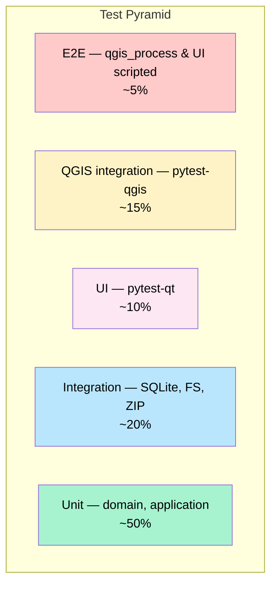

# Smart Layout Builder — Testing Strategy

> **Goal:** ≥ 80% line coverage AND high *behavioral* confidence.
> **Frameworks:** `pytest`, `pytest-qt`, `pytest-qgis`, `pytest-benchmark`, `Hypothesis`.
> **Companion to:** [`architecture.md`](architecture.md), [`folder-structure.md`](folder-structure.md).

---

## 1. Test Pyramid



| Level | Speed | Stability | Quantity |
|-------|-------|-----------|----------|
| Unit | ms | Very high | Many |
| Integration | 10s of ms | High | Moderate |
| UI | 100s of ms | Moderate | Selective |
| QGIS integration | seconds | Moderate | Selective |
| E2E | tens of seconds | Lower | Few |

---

## 2. Test Types

### 2.1 Unit Tests — `tests/unit/`

- Cover `domain/`, `application/`, `utils/`, pure parts of `io/`.
- **Zero** QGIS / Qt / SQLite / filesystem dependencies.
- Run on any CI; no plugin install needed.
- Target: ≥ 90% line + branch coverage in these layers.

Example targets:

- `LayoutEngine.compose()` over 30+ fixture inputs.
- `LegendCurator.prune()` rule combinations.
- `ConstraintSolver` property-based tests with Hypothesis.
- `DynamicTextEngine.resolve()` token grammar.
- Sanitizer: `tests/unit/ai/test_sanitizer.py` over 100+ seeded strings.

### 2.2 Integration Tests — `tests/integration/`

Touches real SQLite, real filesystem (tmp), real ZIP files. Still no QGIS.

- Migration roundtrip per schema version.
- Template install / uninstall / lock with `.slbtmpl` archives.
- Preset CRUD across restarts.
- AI cache: hit / miss / expiry / eviction.

### 2.3 UI Tests — `tests/qgis/ui/`

Use `pytest-qt` to drive widgets in a real `QApplication`. May not need QGIS.

- Dock panel opens, tabs switch, signals fire.
- Wizard pages advance/back correctly.
- Settings dialog validates inputs.

### 2.4 QGIS Integration Tests — `tests/qgis/`

Run inside QGIS via `pytest-qgis` or `qgis_process`. Real `QgsProject`, real layers.

- Materialize `QgsPrintLayout` and verify item types & geometry.
- Atlas export over a 5-feature fixture; verify N PDFs produced.
- Cancel atlas mid-flight; verify temp dir cleaned up.

### 2.5 Performance Tests — `tests/performance/`

`pytest-benchmark`. Baseline + regression budget.

- `test_layout_compose_50_layers` — must complete < 200 ms.
- `test_atlas_export_56_pdf` — must complete < 60 s on 4 cores.
- `test_preview_render_a4_300dpi` — must complete < 1.5 s cold.

Regressions > 10% fail CI.

### 2.6 Architecture Tests — `tests/architecture/`

Statically verify dependency rules.

- `test_domain_no_qgis_import` — grep `slb/domain/` for `qgis` → fail if found.
- `test_domain_no_qt_import` — same for `PyQt*`, `Qt*`.
- `test_ports_are_protocols` — every `ports/*` module exports only `Protocol`s.
- `test_fk_indexed` — every FK column in the schema has an index.
- `test_no_circular_imports` — uses `pydeps` graph.

### 2.7 Export Validation Tests

Golden-PDF tests for each default preset.

- Render the same project + preset → produced PDF must byte-match the golden (after stripping volatile bytes: timestamps, doc-IDs).
- A *visual* diff is also produced (PNG render of each page; compared with `Pillow` `ImageChops` + tolerance).
- Failure shows side-by-side diff in CI artifacts.

### 2.8 Atlas Stress Tests

- 1000-feature coverage layer (synthetic).
- 4, 8, 16 workers — assert linear-ish scaling.
- Memory ceiling: max RSS per worker < 800 MB.
- Cancel at 50% — assert all temp PDFs gone within 5 s.
- Resume after kill -9 — assert no double-rendering.

### 2.9 Compatibility Tests

Run the full unit + integration + QGIS suite on the matrix:

| OS | QGIS | Python | PyQt |
|----|------|--------|------|
| Ubuntu 22.04 | 3.28 LTR | 3.10 | PyQt5 |
| Ubuntu 24.04 | 3.34 LTR | 3.12 | PyQt5 |
| Ubuntu 24.04 | 3.40 LTR | 3.12 | PyQt6 |
| macOS 13 | 3.34 LTR | 3.11 | PyQt5 |
| Windows 11 | 3.34 LTR | 3.12 | PyQt5 |
| Windows 11 | 3.40 LTR | 3.12 | PyQt6 |

### 2.10 Regression Tests

- Every fixed bug gets a test in `tests/regression/` named after the issue number.
- Tests are kept indefinitely.
- CI fails if any regression test fails.

### 2.11 Localization Tests

- `tests/i18n/test_translations.py`:
  - Every user-visible string wrapped in `self.tr()`.
  - All keys present in every locale (no `??unfound??`).
  - Roundtrip: `pylupdate5` → `lrelease` produces stable `.qm`.

### 2.12 Security Tests

- ZIP-slip: install a malicious `.slbtmpl` with `..` paths → must reject.
- Sanitizer leakage: feed PII fixtures → assert output strips them.
- Secrets: assert no API key ever written to disk outside keyring.
- Schema injection: AI returns malformed JSON → must fail closed.

---

## 3. Test Fixtures

```
tests/fixtures/
├── projects/
│   ├── empty.qgz
│   ├── three_layers.qgz
│   ├── raster_heavy.qgz
│   ├── disaster_atlas/             # 56-feature coverage
│   └── stress_1000_features/
├── templates/
│   ├── valid_v1.slbtmpl
│   ├── valid_v2.slbtmpl
│   ├── malicious_zip_slip.slbtmpl
│   └── bad_checksum.slbtmpl
├── presets/
│   ├── valid_default.json
│   └── invalid_schema.json
├── pdfs/                           # Golden outputs
│   ├── classic_a4_three_layers.pdf
│   └── …
├── ai_inputs/
│   ├── layout_request.json
│   └── …
├── ai_outputs/
│   ├── good_layout_proposal.json
│   ├── bad_layout_proposal.json
│   └── …
└── pii_seed.txt                    # For sanitizer tests
```

---

## 4. Coverage Requirements

| Layer | Minimum | Aim |
|-------|---------|-----|
| `domain/` | 90% | 95% |
| `application/` | 85% | 95% |
| `io/` | 80% | 90% |
| `infrastructure/` | 60% | 80% |
| `ui/` | 40% | 70% |
| `ai/` | 80% | 90% |
| **Overall** | **80%** | **88%** |

Excluded from coverage:
- `slb/__init__.py` (3-line entry point).
- `slb/resources/compiled/**` (generated).
- `slb/i18n/compiled/**` (generated).

---

## 5. CI Pipeline

```mermaid
flowchart LR
    PR[PR opened] --> LINT[ruff + mypy + black --check]
    LINT --> UNIT[Unit tests + coverage]
    UNIT --> INT[Integration tests]
    INT --> ARCH[Architecture tests]
    ARCH --> UI[UI tests (pytest-qt)]
    UI --> QGIS[QGIS matrix tests]
    QGIS --> PERF[Performance regression]
    PERF --> SEC[Security tests]
    SEC --> COV[Coverage gate ≥ 80%]
    COV --> MERGE[Mergeable ✓]
```

- Lint runs in < 30 s; gate quickly.
- Unit + integration + arch + UI: ~5 min.
- QGIS matrix: ~15 min total, parallelized.
- Performance: only on merge to main (not every PR).

---

## 6. Test Doubles

### 6.1 Fakes (preferred over mocks where stateful)

- `FakeStorage` — in-memory dict.
- `FakeFilesystem` — in-memory tree.
- `FakeAIProvider` — fixture-driven; deterministic; controls `is_available()`.
- `FakeQGISBridge` — minimal `IQGISBridge` for domain tests.
- `FakeClock` — controls `datetime.now()` for time-sensitive tests.

### 6.2 Mocks (preferred for verifying interactions)

- HTTP client (`requests-mock`).
- QgsTaskManager (use `pytest-qgis` fixtures).

### 6.3 Avoid

- Mocking the domain (it's pure — instantiate it directly).
- Patching `qgis.*` from non-QGIS test contexts.

---

## 7. Property-Based Testing (Hypothesis)

Targets where exhaustive enumeration is impractical:

- `ConstraintSolver`: random items in random papers → output never overlaps, never escapes paper.
- `LegendCurator`: any layer set → idempotent (`prune(prune(L)) == prune(L)`).
- `DynamicTextEngine`: random valid token strings → parse and re-emit equal text.
- `PDF Merger`: random N inputs → output has N pages, in input order.

Example skeleton:

```python
from hypothesis import given, strategies as st

@given(
    layers=st.lists(layer_strategy(), min_size=0, max_size=200),
    extent=extent_strategy(),
)
def test_legend_curator_idempotent(layers, extent):
    curator = LegendCurator()
    once = curator.prune(layers, extent)
    twice = curator.prune(once, extent)
    assert once == twice
```

---

## 8. Mutation Testing (optional, post-MVP)

Use `mutmut` against `domain/` to verify tests *actually fail* on logic changes. Target ≥ 70% mutation kill rate.

---

## 9. Snapshot Testing

For UI / serialization stability:

- Preset JSON snapshots: re-serializing must match snapshot byte-for-byte.
- Layout XML snapshots after materialization.
- Preview thumbnail snapshots (PNG diff with tolerance).

Snapshots live in `tests/snapshots/` next to the producing test.

---

## 10. Test Naming & Layout

```python
# tests/unit/domain/engine/test_layout_engine.py

class TestLayoutEngine:
    class TestCompose:
        def test_returns_empty_result_for_empty_request(self): ...
        def test_places_map_centered_when_grid_strategy(self): ...
        def test_legend_is_pruned_via_curator(self): ...
        def test_respects_paper_size(self): ...
        def test_raises_validation_error_on_invalid_extent(self): ...
```

Naming rule: `test_<expected behavior>_<when condition>`.

---

## 11. Manual / Exploratory Testing

Per release, a manual checklist runs (template in `docs/release-checklist.md`):

- [ ] Fresh QGIS profile install.
- [ ] First-run wizard runs.
- [ ] Generate layout on a 1-layer project.
- [ ] Generate layout on a 200-layer project (no UI freeze).
- [ ] Atlas export 56 features → 56 PDFs + merge.
- [ ] Cancel mid-export; resume.
- [ ] Switch theme; switch locale; verify UI updates.
- [ ] Install malicious template → rejected.
- [ ] AI tab works with each provider.
- [ ] Uninstall plugin cleanly (no leftover toolbar/menu).

---

## 12. Bug Reports → Tests

When a bug is reported:

1. **Reproduce** locally.
2. **Write a failing test** at the lowest viable level (prefer unit).
3. **Fix** the code.
4. **Verify** the test passes.
5. **Land** test + fix in the same PR.

Bug PRs without a regression test do not merge.

---

## 13. Test Performance

- The full unit suite must run in **< 30 s** on a developer laptop.
- The integration suite must run in **< 90 s**.
- The full local suite (no QGIS matrix) must run in **< 5 min**.

Tests slower than 1 s are tagged `@pytest.mark.slow` and skipped in default runs (`pytest -m 'not slow'`).

---

## 14. Documentation as Test

- Code samples in `docs/api/` are extracted and executed via `pytest-codeblocks`.
- README install steps are smoke-tested on each release in a clean container.

---

## 15. Test-Driven Development

Following the global TDD rule:

1. RED — write failing test.
2. GREEN — minimal implementation.
3. REFACTOR — clean up.

Enforced by **convention** + **PR review** + the `tdd-guide` agent (used during feature work).

---

## 16. Owning Flakiness

- Flaky tests are quarantined into `tests/quarantine/` with an issue number.
- Quarantine runs in CI but does **not** fail the build.
- Each quarantined test must be fixed or deleted within 14 days.

---

*End of testing-strategy.md*
