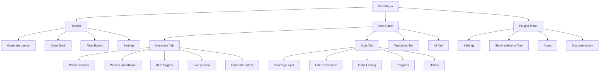
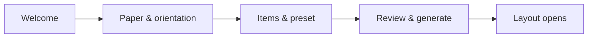
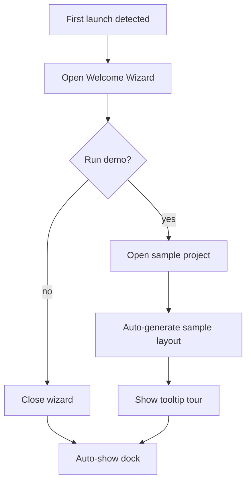
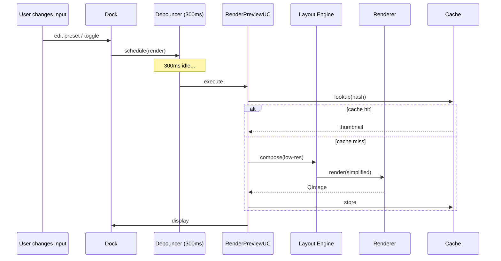

# Smart Layout Builder — UI / UX Design

> **Companion to:** [`features.md`](features.md), [`architecture.md`](architecture.md)

---

## 1. UX Principles

| # | Principle | Implication |
|---|-----------|-------------|
| UX1 | **Show, don't ask** | Live preview, sensible defaults, no modal-first flows. |
| UX2 | **One screen, one job** | Each dock tab maps to one mental model. |
| UX3 | **Keyboard-first** | Every action has a discoverable shortcut. |
| UX4 | **Make destructive things reversible** | All destructive ops undoable or trash-binned. |
| UX5 | **Progress is sacred** | Long ops show ETA, % done, current item, cancel button. |
| UX6 | **Explain failures** | Errors carry: what failed, why, how to fix, link to docs. |
| UX7 | **Respect the user's environment** | Inherit QGIS theme; respect locale; respect accessibility settings. |
| UX8 | **No surprises** | Atlas export never overwrites without explicit consent; AI never sends data without consent. |
| UX9 | **Density over chrome** | Power users want compactness; novices get tooltips, not handholding screens. |

---

## 2. Information Architecture



---

## 3. Toolbar

A single, compact toolbar with 4 actions:

| Icon | Action | Shortcut | Tooltip |
|------|--------|----------|---------|
| 🪄 | Generate Layout | `Ctrl+Shift+L` | "Compose a layout from the current project state" |
| 📌 | Show / Hide Dock | `Ctrl+Shift+D` | "Toggle the SLB panel" |
| 📚 | Batch Atlas Export | `Ctrl+Shift+A` | "Export an atlas across a coverage layer" |
| ⚙️ | Settings | — | "Open SLB settings" |

The toolbar is named `SLBToolBar` and can be moved by the user (QGIS-native).

---

## 4. Dock Panel

### 4.1 Layout

```
┌──────────────────────────────────────────────┐
│ ▣ Smart Layout Builder                  ✕  ─ │
├──────────────────────────────────────────────┤
│ ◉ Compose │ Atlas │ Templates │ AI           │
├──────────────────────────────────────────────┤
│ Preset:  [ Classic A4 ▼ ]  [ + ]  [ ✎ ]      │
│ Paper:   [ A4 ▼ ]  Orientation: ◉ P  ◯ L     │
│                                              │
│ Items:                                       │
│  ☑ Title       ☑ Legend     ☑ Scale bar     │
│  ☑ North arrow ☐ Inset map  ☑ Attribution   │
│                                              │
│ ┌──────────────────────────────────────────┐ │
│ │                                          │ │
│ │           [ Live Preview ]               │ │
│ │                                          │ │
│ └──────────────────────────────────────────┘ │
│                                              │
│ [ Generate Layout ]  [ Open in Designer ]    │
└──────────────────────────────────────────────┘
```

### 4.2 Tabs

#### 4.2.1 Compose Tab

The default tab. The user's primary surface.

- **Preset selector**: dropdown of presets, with + (new), ✎ (edit), ⭐ (favorite toggle).
- **Paper + orientation**: dropdown for size; radio for orientation.
- **Item toggles**: checkboxes for cartographic elements.
- **Live preview**: scaled rendering of the layout; updates with debounce.
- **Actions**: `Generate Layout` (primary) and `Open in Designer` (secondary, opens QGIS Layout Designer with the generated layout).

#### 4.2.2 Atlas Tab

```
┌──────────────────────────────────────────────┐
│ Coverage layer:  [ kelurahan ▼ ]             │
│ Filter:          [ "kecamatan" = 'Banjar' ]  │
│ Feature count:   56                          │
│                                              │
│ Output folder:   [ /home/.../export/ ] [...] │
│ Filename:        [ peta_[%kelurahan%].pdf ]  │
│ Format:          ◉ PDF  ◯ PNG  ◯ SVG         │
│ Merge into single PDF:  ☑                    │
│ Parallel workers:       [ 4 ]                │
│                                              │
│ ▼ Advanced                                   │
│   DPI:       [ 300 ]                         │
│   Resume previous job:  ☐                    │
│                                              │
│ [ Estimate ]  [ Start Export ]               │
│                                              │
│ ── Progress ─────────────────────────────    │
│ ▓▓▓▓▓▓▓▓░░░░░░░░░░  42/56 (75%)  ETA 2:18    │
│ Current: Banjar_Selatan ── worker 2          │
│ [ Cancel ] [ Pause ]                         │
│                                              │
│ ── History ────────────────────────  ⟳       │
│ ✅ 2026-05-28 14:01  PDF  56 pages  3:45     │
│ ✅ 2026-05-27 09:14  PNG  56 files  2:08     │
│ ❌ 2026-05-26 16:30  PDF  failed at #34      │
└──────────────────────────────────────────────┘
```

#### 4.2.3 Templates Tab

```
┌──────────────────────────────────────────────┐
│ [ 🔍 search… ]  [ All | Shipped | User | Org]│
│                                              │
│ ┌──────────────┐  ┌──────────────┐           │
│ │  [thumbnail] │  │  [thumbnail] │           │
│ │              │  │              │           │
│ │ Classic A4   │  │ Editorial A3 │           │
│ │ shipped • 🔒 │  │ user • v2.1  │           │
│ └──────────────┘  └──────────────┘           │
│ ┌──────────────┐  ┌──────────────┐           │
│ │  [thumbnail] │  │  [thumbnail] │           │
│ │ Govt-ID      │  │ Minimal      │           │
│ │ org • 🔒     │  │ user • v1.0  │           │
│ └──────────────┘  └──────────────┘           │
│                                              │
│ [ Install from file… ]  [ Browse Marketplace]│
└──────────────────────────────────────────────┘
```

Drag-and-drop a `.slbtmpl` onto the panel to install.

#### 4.2.4 AI Tab

```
┌──────────────────────────────────────────────┐
│ Provider:  [ OpenAI (gpt-4o) ▼ ]   [⚙ Setup] │
│ Status:    🟢 Connected   Budget: 17/100k    │
│                                              │
│ Action:    [ Suggest layout ▼ ]              │
│                                              │
│ Context to share:                            │
│  ☑ Layer list (sanitized)                    │
│  ☑ Current preset                            │
│  ☐ Map screenshot (proof-of-concept)         │
│                                              │
│ [ Ask AI ]                                   │
│                                              │
│ ── Suggestion ─────────────────────────────  │
│ The layout feels right-heavy. Consider:      │
│  • Moving the legend to the left.            │
│  • Shrinking the scale bar to 1/3 width.     │
│                                              │
│ [ Apply ] [ Discard ] [ Explain ] [ Save ]   │
└──────────────────────────────────────────────┘
```

---

## 5. Wizard Flow (First-Run / On-Demand)

A 4-page `QWizard`:



### Page 1 — Welcome

- One-line value prop.
- "Don't show again" checkbox.
- "Skip" button.

### Page 2 — Paper

- Visual paper selector (rendered rectangles, click to choose).
- Orientation segmented control.

### Page 3 — Content

- Multi-check for items (Title, Legend, Scale bar, North arrow, Inset, Attribution).
- Title text field (prefilled from project metadata).
- Preset picker (with "preview" button).

### Page 4 — Summary

- Read-only summary of choices.
- Two buttons: `Generate` (primary) and `Generate & Edit in Designer`.

---

## 6. Export Dialog (Modal)

Used when launching atlas / report export from the toolbar (faster than tab).

```
┌── Export Atlas ──────────────────────────────┐
│                                              │
│ Coverage:    [ kelurahan ▼ ]                 │
│ Filter:      [ ... ]                         │
│ Output:      [ folder ] [...]                │
│ Filename:    [ peta_[%kelurahan%].pdf ]      │
│ Format:      [ PDF ▼ ]   DPI: [ 300 ]        │
│ Workers:     [ 4 ]                           │
│ Merge:       ☑ single PDF                    │
│ Estimate:    ~3:40 for 56 features           │
│                                              │
│ [ Cancel ]                       [ Export ]  │
└──────────────────────────────────────────────┘
```

After clicking Export, the dialog becomes a **progress panel** with the same controls as in the Atlas tab.

---

## 7. Settings Dialog

Tabbed dialog: `General`, `AI`, `Templates`, `Performance`, `Advanced`, `About`.

### 7.1 General

- Theme: System / Light / Dark.
- Language: detected from QGIS locale, override available.
- Default paper size.
- Default preset.
- Show preview while typing: on/off.
- Telemetry (opt-in): off by default.

### 7.2 AI

- Default provider.
- API keys (stored in OS keyring, never echoed back).
- Monthly token budget.
- Cache TTL.
- Sanitization rules (toggleable, with a "see what gets sent" preview).

### 7.3 Templates

- Templates directory.
- Auto-update shipped templates: on/off.
- Marketplace URL.
- Trust roots (Ed25519 keys, with import).

### 7.4 Performance

- Default parallel workers.
- Max memory per worker.
- Preview DPI.
- Cache size limit.

### 7.5 Advanced

- Log level.
- Open logs folder.
- Open SLB data folder.
- Reset to defaults.
- Export diagnostic bundle (for bug reports).

### 7.6 About

- Version, build, QGIS version, Python version.
- Credits.
- License.
- Links: Repo, Docs, Issue tracker, Community.

---

## 8. Onboarding Flow



- **Detection:** absence of `~/.qgis/SLB/first_run_complete` marker.
- **Tooltip tour:** 5 sequential popovers on dock elements.
- **Re-runnable:** Settings → General → "Show Welcome Tour".

---

## 9. Accessibility

| Concern | Implementation |
|---------|----------------|
| **Keyboard navigation** | Every action reachable via Tab; primary action always default-focused. |
| **Screen readers** | Set `accessibleName` and `accessibleDescription` on all widgets. |
| **Color contrast** | All text ≥ WCAG AA 4.5:1; verified per-theme. |
| **Don't rely on color alone** | Status icons + text; error highlights also use icon. |
| **Reduced motion** | Animations gated on `QApplication.styleHints().showIsFullScreen()` and a setting. |
| **Font scaling** | Use `QFont::pointSize` not pixel; respect system DPI. |
| **Localization** | All user-visible strings wrapped in `self.tr()`; RTL languages tested. |
| **Tooltips** | Tooltip + status-bar text for every action; not the only source of info. |

---

## 10. Responsive Behavior

Dock width is user-resizable. Layouts must adapt:

| Width | Behavior |
|-------|----------|
| **< 280 px** | Items collapse into a "More…" expander; preview hidden, "Show preview" button revealed. |
| **280 – 420 px** | Default layout; preview at small size. |
| **> 420 px** | Preview enlarges; items stay in single column. |

Dialogs (Export, Settings) use `QFormLayout` and reflow on resize.

---

## 11. Live Preview Design



- **Debounce:** 300 ms idle → render.
- **Simplification:** preview uses lower DPI and skips label-collision pass.
- **Cancellation:** new render cancels in-flight one.

---

## 12. Workflow Optimization

### 12.1 Common Workflows

| Workflow | Steps Before | Steps After (SLB) |
|----------|--------------|--------------------|
| Single map PDF | 12 | 2 (Generate + Print) |
| 56-page atlas | 25+ | 4 (pick coverage, set name template, click Export, wait) |
| Reusable house style | "Document it in a manual" | Save as preset → share `.slbtmpl` |
| Try 3 layouts to compare | 30 minutes | 3 clicks (3 presets) |
| Update legend after layer changes | Manual | Auto via Smart Legend Cleaner |

### 12.2 Power-User Shortcuts

| Shortcut | Action |
|----------|--------|
| `Ctrl+Shift+L` | Generate layout (last preset) |
| `Ctrl+Shift+A` | Open Atlas dialog |
| `Ctrl+Shift+D` | Toggle dock |
| `Ctrl+Shift+T` | Cycle through presets |
| `Ctrl+Shift+P` | Open preset editor |
| `Ctrl+Shift+R` | Refresh preview |
| `Esc` | Cancel current export |
| `F1` | Open docs at current screen |

All shortcuts are reassignable via QGIS keyboard shortcut manager.

---

## 13. Interaction Design Patterns

### 13.1 Loading

- Skeleton screens for lists that take > 200 ms to load.
- Spinner for atomic ops (e.g., "Saving preset…").
- Progress panel for tasks > 2 s.

### 13.2 Confirmation

- Destructive ops (delete preset, uninstall template) → confirmation modal with item name typed in (high-risk only).
- Overwriting export output → confirmation with "Do not ask again" option.

### 13.3 Empty States

Every list / panel has an empty state with a friendly message and a call-to-action button.

- **No presets:** "You don't have any presets yet. [Create your first preset]"
- **No history:** "No exports yet. Run your first atlas export to populate this."
- **No templates:** "Templates package layouts for reuse. [Install your first template]"

### 13.4 Error States

```
┌── Error ─────────────────────────────────────┐
│ ⚠ Atlas export failed at feature 34          │
│                                              │
│ Reason: Output folder is read-only.          │
│                                              │
│ Try this:                                    │
│   • Choose a different output folder.        │
│   • Check folder permissions.                │
│                                              │
│ [ Copy details ]  [ Open logs ]  [ Close ]   │
└──────────────────────────────────────────────┘
```

### 13.5 Notifications

- **Inline banner** for non-blocking info (e.g., "AI provider not configured").
- **QGIS message bar** for transient notices.
- **System notification** for long jobs that finished while QGIS was minimized.

---

## 14. Visual Design

### 14.1 Theme Strategy

- Inherit QGIS theme (light/dark detected via `QPalette.window().lightness()`).
- Override only where QGIS palette is insufficient (e.g., emphasized buttons).

### 14.2 Typography

- Primary: system font (QGIS default).
- Mono (for expressions, file paths): system mono.
- No bundled custom fonts in MVP (bundled fonts are an asset risk).

### 14.3 Iconography

- Source: tabler.io / lucide (MIT-licensed).
- All icons SVG; rasterized at usage.
- Consistent stroke weight (1.5px); 16/20/24 px sizes.

### 14.4 Color

| Role | Light | Dark |
|------|-------|------|
| Primary action | `#1565C0` | `#64B5F6` |
| Success | `#2E7D32` | `#81C784` |
| Warning | `#EF6C00` | `#FFB74D` |
| Error | `#C62828` | `#EF9A9A` |
| Info | `#0277BD` | `#4FC3F7` |
| Surface | inherit QGIS | inherit QGIS |
| Text | inherit QGIS | inherit QGIS |

---

## 15. Microcopy Guidelines

- **Be brief.** Three words better than seven.
- **Be specific.** "Save preset" > "Save".
- **Speak to the user.** "Your preset has been saved." > "Preset saved successfully."
- **Avoid jargon for novices.** "Map area" preferred over "Composer item".
- **Verbs on buttons.** "Export atlas" > "Atlas".

---

## 16. UX Quality Checklist (per release)

- [ ] All actions have keyboard shortcuts.
- [ ] All controls have tooltips + accessible names.
- [ ] All errors have actionable suggestions.
- [ ] All long ops are cancellable.
- [ ] All destructive ops are confirmed.
- [ ] First-run wizard tested in clean profile.
- [ ] Dock layout works at 280 / 420 / 700 px widths.
- [ ] Dark theme tested.
- [ ] At least 2 locales tested (EN + ID).
- [ ] No untranslated user-visible strings.

---

*End of ui-ux.md*
